# QoS (Quality of Service) Component - Technical Design Specification

## Executive Summary

This document defines a Quality of Service (QoS) component for the MaaS billing platform that intelligently prioritizes AI model inference requests based on user tiers, SLA requirements, and real-time system capacity. The QoS component ensures enterprise users receive guaranteed service quality while maximizing overall system utilization.

## Problem Statement

**Current Challenge:**
- LLM inference has limited throughput (e.g., 1 RPS under high load)
- All requests are processed first-come-first-served
- Enterprise users can be blocked by free-tier users during peak load
- No SLA guarantees or differentiated service quality

**Business Impact:**
- Revenue loss from enterprise customer churn
- Unable to offer premium service tiers with technical backing
- Inefficient resource utilization during peak periods

## Architecture Overview

### Current Request Flow


### New QoS-Enhanced Flow


## Component Architecture

### QoS Service Design

```mermaid
graph TB
    subgraph "QoS Prioritizer Service"
        subgraph "Request Processing"
            Receiver[📥 Request Receiver]
            Classifier[🏷️ Priority Classifier]
            Router[🔀 Request Router]
        end
        
        subgraph "Queue Management"
            PQ1[🚀 Enterprise Queue<br/>Priority 1]
            PQ2[💼 Premium Queue<br/>Priority 2]
            PQ3[🆓 Free Queue<br/>Priority 3]
            Scheduler[⚡ Weighted Scheduler]
        end
        
        subgraph "Capacity Management"
            Monitor[📊 Capacity Monitor]
            Circuit[🔌 Circuit Breaker]
            Backpressure[⬅️ Backpressure Control]
        end
        
        subgraph "Observability"
            Metrics[📈 Metrics Collector]
            Logger[📝 Request Logger]
            Tracer[🔍 Distributed Tracing]
        end
    end
    
    Receiver --> Classifier
    Classifier --> Router
    Router --> PQ1
    Router --> PQ2
    Router --> PQ3
    
    PQ1 --> Scheduler
    PQ2 --> Scheduler
    PQ3 --> Scheduler
    
    Monitor --> Circuit
    Circuit --> Backpressure
    Scheduler --> Monitor
    
    Scheduler --> Metrics
    Receiver --> Logger
    Router --> Tracer
    
    classDef queue fill:#e8f5e8
    classDef process fill:#e3f2fd
    classDef monitor fill:#fff3e0
    classDef observe fill:#fce4ec
    
    class PQ1,PQ2,PQ3,Scheduler queue
    class Receiver,Classifier,Router process
    class Monitor,Circuit,Backpressure monitor
    class Metrics,Logger,Tracer observe
```



## Priority Classification System

### Priority Factors and Scoring

```yaml
priority_factors:
  user_tier:
    enterprise: 100
    premium: 50
    free: 10
    
  request_type:
    synchronous: 20
    asynchronous: 0
    
  sla_tier:
    guaranteed: 30
    best_effort: 0
    
  user_behavior_score:
    good_citizen: 10    # Low abuse, proper usage
    normal: 0
    problematic: -20    # High abuse, rate limit violations
    
  time_based_multiplier:
    peak_hours: 0.8     # Slightly lower priority during peak
    off_hours: 1.2      # Higher priority during off-hours
    
  request_size:
    small: 5           # < 1K tokens
    medium: 0          # 1K-5K tokens
    large: -10         # > 5K tokens
```

### Priority Score Calculation

```typescript
interface PriorityFactors {
  userTier: 'enterprise' | 'premium' | 'free';
  requestType: 'sync' | 'async';
  slaTier: 'guaranteed' | 'best_effort';
  userBehaviorScore: number;
  timeBasedMultiplier: number;
  requestSize: 'small' | 'medium' | 'large';
}

function calculatePriority(factors: PriorityFactors): number {
  const baseScore = TIER_SCORES[factors.userTier] +
                   REQUEST_TYPE_SCORES[factors.requestType] +
                   SLA_SCORES[factors.slaTier] +
                   factors.userBehaviorScore +
                   REQUEST_SIZE_SCORES[factors.requestSize];
                   
  return Math.max(0, baseScore * factors.timeBasedMultiplier);
}
```

## Queue Management Algorithms

### 1. Weighted Fair Queuing (WFQ)

```typescript
interface QueueWeights {
  enterprise: 70;  // 70% of capacity
  premium: 20;     // 20% of capacity  
  free: 10;        // 10% of capacity
}

class WeightedScheduler {
  private queues: Map<string, PriorityQueue>;
  private weights: QueueWeights;
  private virtualTime: number = 0;
  
  schedule(): Request | null {
    // Calculate next virtual finish time for each queue
    const candidates = this.queues.entries()
      .filter(([_, queue]) => !queue.isEmpty())
      .map(([tier, queue]) => ({
        tier,
        request: queue.peek(),
        finishTime: this.calculateVirtualFinishTime(tier, queue.peek())
      }))
      .sort((a, b) => a.finishTime - b.finishTime);
    
    if (candidates.length === 0) return null;
    
    const selected = candidates[0];
    this.virtualTime = selected.finishTime;
    return this.queues.get(selected.tier)!.dequeue();
  }
}
```

### 2. Aging Mechanism (Starvation Prevention)

```typescript
interface AgedRequest {
  request: Request;
  arrivalTime: number;
  currentPriority: number;
  basePriority: number;
}

class AgingScheduler {
  private agingRate = 1; // Priority boost per second
  private maxAging = 50; // Maximum aging bonus
  
  updatePriorities(): void {
    const now = Date.now();
    
    for (const queue of this.queues.values()) {
      queue.forEach(item => {
        const ageSeconds = (now - item.arrivalTime) / 1000;
        const agingBonus = Math.min(
          this.maxAging, 
          ageSeconds * this.agingRate
        );
        item.currentPriority = item.basePriority + agingBonus;
      });
      
      // Re-sort queue after priority updates
      queue.resort();
    }
  }
}
```

## Capacity Detection and Management

### Model Capacity Monitoring

```typescript
interface CapacityMetrics {
  currentQueueDepth: number;
  averageResponseTime: number;
  requestsPerSecond: number;
  activeConnections: number;
  gpuUtilization: number;
}

class CapacityMonitor {
  private thresholds = {
    queueDepth: { low: 5, high: 20 },
    responseTime: { low: 2000, high: 10000 }, // ms
    rps: { low: 0.5, high: 2.0 },
    gpuUtil: { low: 70, high: 95 } // percentage
  };
  
  assessCapacity(metrics: CapacityMetrics): CapacityLevel {
    const scores = [
      this.scoreMetric(metrics.queueDepth, this.thresholds.queueDepth),
      this.scoreMetric(metrics.averageResponseTime, this.thresholds.responseTime),
      this.scoreMetric(metrics.requestsPerSecond, this.thresholds.rps, true),
      this.scoreMetric(metrics.gpuUtilization, this.thresholds.gpuUtil)
    ];
    
    const avgScore = scores.reduce((a, b) => a + b) / scores.length;
    
    if (avgScore >= 0.8) return CapacityLevel.HIGH;
    if (avgScore >= 0.4) return CapacityLevel.MEDIUM;
    return CapacityLevel.LOW;
  }
}
```

### Circuit Breaker Pattern

```typescript
enum CircuitState {
  CLOSED,   // Normal operation
  OPEN,     // Rejecting requests
  HALF_OPEN // Testing recovery
}

class CircuitBreaker {
  private state = CircuitState.CLOSED;
  private failures = 0;
  private lastFailTime = 0;
  private successCount = 0;
  
  private readonly failureThreshold = 5;
  private readonly timeoutMs = 30000; // 30 seconds
  private readonly successThreshold = 3;
  
  async execute<T>(operation: () => Promise<T>): Promise<T> {
    if (this.state === CircuitState.OPEN) {
      if (Date.now() - this.lastFailTime > this.timeoutMs) {
        this.state = CircuitState.HALF_OPEN;
        this.successCount = 0;
      } else {
        throw new CircuitBreakerOpenError();
      }
    }
    
    try {
      const result = await operation();
      this.onSuccess();
      return result;
    } catch (error) {
      this.onFailure();
      throw error;
    }
  }
}
```

## API Specification

### QoS Service REST API

```yaml
openapi: 3.0.0
info:
  title: QoS Prioritizer API
  version: 1.0.0

paths:
  /api/v1/inference:
    post:
      summary: Submit inference request with QoS
      requestBody:
        required: true
        content:
          application/json:
            schema:
              type: object
              properties:
                model_id:
                  type: string
                prompt:
                  type: string
                max_tokens:
                  type: integer
                priority_hint:
                  type: string
                  enum: [low, normal, high]
                timeout_ms:
                  type: integer
                  default: 30000
      responses:
        '200':
          description: Successful inference
        '202':
          description: Request queued
        '429':
          description: Rate limited
        '503':
          description: Service unavailable

  /api/v1/queue/status:
    get:
      summary: Get queue status and metrics
      responses:
        '200':
          content:
            application/json:
              schema:
                type: object
                properties:
                  queues:
                    type: object
                    properties:
                      enterprise:
                        $ref: '#/components/schemas/QueueStats'
                      premium:
                        $ref: '#/components/schemas/QueueStats'
                      free:
                        $ref: '#/components/schemas/QueueStats'
                  capacity:
                    $ref: '#/components/schemas/CapacityStatus'

components:
  schemas:
    QueueStats:
      type: object
      properties:
        depth: 
          type: integer
        avg_wait_time:
          type: number
        throughput:
          type: number
        
    CapacityStatus:
      type: object
      properties:
        level:
          type: string
          enum: [low, medium, high]
        utilization:
          type: number
        available_slots:
          type: integer
```

### Configuration Format

```yaml
# qos-config.yaml
apiVersion: v1
kind: ConfigMap
metadata:
  name: qos-config
  namespace: llm
data:
  config.yaml: |
    qos:
      # Queue Configuration
      queues:
        enterprise:
          weight: 70
          max_size: 100
          timeout_ms: 60000
        premium:
          weight: 20
          max_size: 50
          timeout_ms: 45000
        free:
          weight: 10
          max_size: 20
          timeout_ms: 30000
      
      # Scheduling Algorithm
      scheduler:
        type: "weighted_fair_queuing"
        aging_enabled: true
        aging_rate: 1.0
        max_aging_bonus: 50
      
      # Capacity Management
      capacity:
        monitor_interval_ms: 1000
        thresholds:
          queue_depth_high: 20
          response_time_high: 10000
          gpu_utilization_high: 95
      
      # Circuit Breaker
      circuit_breaker:
        enabled: true
        failure_threshold: 5
        timeout_ms: 30000
        success_threshold: 3
      
      # Observability
      metrics:
        enabled: true
        port: 9090
        path: "/metrics"
      
      logging:
        level: "info"
        format: "json"
```

## Integration Points

### 1. Authorino Integration

```typescript
// Extract user tier from Authorino identity headers
interface AuthorinoIdentity {
  groups: string[];        // ["enterprise", "api-users"]
  userId: string;         // "user-12345"
  metadata: {
    tier: string;         // "enterprise"
    sla: string;          // "guaranteed"
  };
}

function extractUserContext(headers: Headers): UserContext {
  const identity = JSON.parse(headers.get('x-auth-identity') || '{}');
  
  return {
    userId: identity.userId,
    tier: identity.metadata?.tier || 'free',
    groups: identity.groups || [],
    slaTier: identity.metadata?.sla || 'best_effort'
  };
}
```

### 2. KServe Integration

```typescript
// Proxy requests to KServe with load balancing
class KServeProxy {
  private endpoints: KServeEndpoint[];
  private healthChecker: HealthChecker;
  
  async forwardRequest(request: InferenceRequest): Promise<InferenceResponse> {
    const healthyEndpoints = await this.healthChecker.getHealthyEndpoints();
    
    if (healthyEndpoints.length === 0) {
      throw new ServiceUnavailableError();
    }
    
    // Simple round-robin for now, could implement more sophisticated load balancing
    const endpoint = this.selectEndpoint(healthyEndpoints);
    
    const startTime = Date.now();
    try {
      const response = await this.httpClient.post(endpoint.url, request);
      this.recordSuccess(endpoint, Date.now() - startTime);
      return response;
    } catch (error) {
      this.recordFailure(endpoint, error);
      throw error;
    }
  }
}
```

### 3. Metrics Integration

```typescript
// Prometheus metrics integration
const qosMetrics = {
  queueDepth: new Gauge({
    name: 'qos_queue_depth',
    help: 'Current queue depth by tier',
    labelNames: ['tier']
  }),
  
  waitTime: new Histogram({
    name: 'qos_request_wait_time_seconds',
    help: 'Request wait time in queue',
    labelNames: ['tier', 'priority'],
    buckets: [0.1, 0.5, 1, 2, 5, 10, 30]
  }),
  
  throughput: new Counter({
    name: 'qos_requests_processed_total',
    help: 'Total requests processed',
    labelNames: ['tier', 'status']
  }),
  
  capacityUtilization: new Gauge({
    name: 'qos_capacity_utilization',
    help: 'Current capacity utilization percentage'
  })
};
```

## Implementation Phases

### Phase 1: MVP Implementation (2-3 weeks)
- **Goals**: Basic priority queuing with manual configuration
- **Features**:
  - Simple 3-tier priority queues (enterprise > premium > free)
  - Static priority scoring based on user tier
  - Basic capacity monitoring via response time
  - Simple round-robin scheduling with weights
  - Basic HTTP proxy to KServe
  - Prometheus metrics

### Phase 2: Advanced Scheduling (2-3 weeks)
- **Goals**: Sophisticated algorithms and dynamic adaptation
- **Features**:
  - Weighted Fair Queuing implementation
  - Aging mechanism for starvation prevention
  - Dynamic priority scoring (behavior, request size, time-based)
  - Circuit breaker pattern for resilience
  - Advanced capacity detection (queue depth, GPU utilization)

### Phase 3: Production Hardening (2-3 weeks)
- **Goals**: Production-ready reliability and observability
- **Features**:
  - Comprehensive monitoring and alerting
  - Distributed tracing integration
  - Graceful degradation modes
  - Load testing and performance optimization
  - Auto-scaling integration
  - Configuration hot-reloading

### Phase 4: Advanced Features (Future)
- **Goals**: ML-driven optimization and enterprise features
- **Features**:
  - ML-based demand prediction
  - Adaptive priority algorithms
  - SLA violation detection and reporting
  - Cost-based optimization
  - Multi-model routing optimization

## Performance Considerations

### Latency Requirements
- **Target**: < 5ms additional latency for priority classification
- **Queue processing**: < 1ms per request
- **Capacity assessment**: < 2ms per check

### Throughput Requirements
- **Target**: Handle 1000+ RPS throughput
- **Queue capacity**: Support 10,000+ queued requests
- **Memory usage**: < 1GB for queue management

### Scalability Design
- **Horizontal scaling**: Stateless design with shared queue backend (Redis)
- **High availability**: Active-passive deployment with health checks
- **Load balancing**: Support multiple QoS service instances

## Security Considerations

### Authentication
- Leverage existing Authorino authentication
- No additional authentication layer required
- Trust headers from authenticated gateway

### Authorization
- Respect existing authorization decisions
- QoS only affects scheduling, not access control
- Audit logging for priority decisions

### Data Privacy
- No persistent storage of request content
- Minimal request metadata retention for metrics
- GDPR compliance for user behavior scoring

## Monitoring and Observability

### Key Metrics

```yaml
Queue Metrics:
  - qos_queue_depth{tier}
  - qos_queue_wait_time{tier,percentile}
  - qos_queue_throughput{tier}
  - qos_requests_dropped{tier,reason}

Performance Metrics:
  - qos_processing_duration{operation}
  - qos_capacity_utilization
  - qos_scheduling_decisions{algorithm,tier}

Business Metrics:
  - qos_sla_violations{tier,type}
  - qos_revenue_protected{tier}
  - qos_user_experience_score{tier}
```

### Alerting Rules

```yaml
Critical Alerts:
  - Queue depth > 50 for any tier
  - Average wait time > 30s for enterprise
  - Circuit breaker open for > 5 minutes
  - QoS service down

Warning Alerts:
  - Capacity utilization > 80%
  - Free tier wait time > 60s
  - Priority inversion detected
  - Unusual traffic patterns
```

### Dashboards

```yaml
Operational Dashboard:
  - Real-time queue depths and wait times
  - Capacity utilization and trends
  - Request flow and success rates
  - Circuit breaker status

Business Dashboard:
  - SLA compliance by tier
  - Revenue impact analysis
  - User experience metrics
  - Capacity planning insights
```

## Testing Strategy

### Unit Tests
- Priority calculation algorithms
- Queue management operations
- Capacity assessment logic
- Circuit breaker state transitions

### Integration Tests  
- End-to-end request flow
- Authorino integration
- KServe proxy functionality
- Metrics collection accuracy

### Load Tests
- High throughput scenarios (1000+ RPS)
- Queue overflow handling
- Capacity limit behavior
- Failover and recovery

### Chaos Engineering
- KServe service failures
- Network partitions
- Resource exhaustion
- Configuration errors

## Success Metrics

### Technical KPIs
- **Latency**: 95th percentile wait time < 30s for enterprise, < 60s for premium
- **Throughput**: Process 100% of requests within SLA windows
- **Availability**: 99.9% uptime for QoS service
- **Accuracy**: < 1% priority misclassifications

### Business KPIs
- **SLA Compliance**: > 99% for enterprise tier
- **Revenue Protection**: Quantify enterprise retention
- **User Satisfaction**: Improved NPS scores for premium tiers
- **Cost Efficiency**: 20% better resource utilization

## Risk Mitigation

### Technical Risks
- **Single point of failure**: Active-passive deployment + health checks
- **Queue overflow**: Circuit breaker + graceful degradation
- **Memory leaks**: Comprehensive monitoring + auto-restart
- **Configuration errors**: Validation + rollback mechanisms

### Business Risks
- **Over-prioritization**: Aging algorithm prevents starvation
- **Under-utilization**: Dynamic capacity adjustment
- **SLA violations**: Proactive monitoring + alerting
- **Complexity**: Phased rollout + feature flags

This technical design provides a comprehensive foundation for implementing a production-ready QoS system that directly addresses the business need for differentiated service quality while maintaining system reliability and observability.