# MaaS Kind Local Development Architecture

This document provides visual architecture diagrams for the MaaS platform running on Kubernetes Kind.

## Overall System Architecture (High-Level)

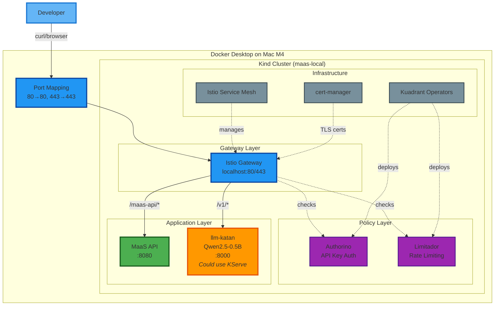

## Detailed System Architecture

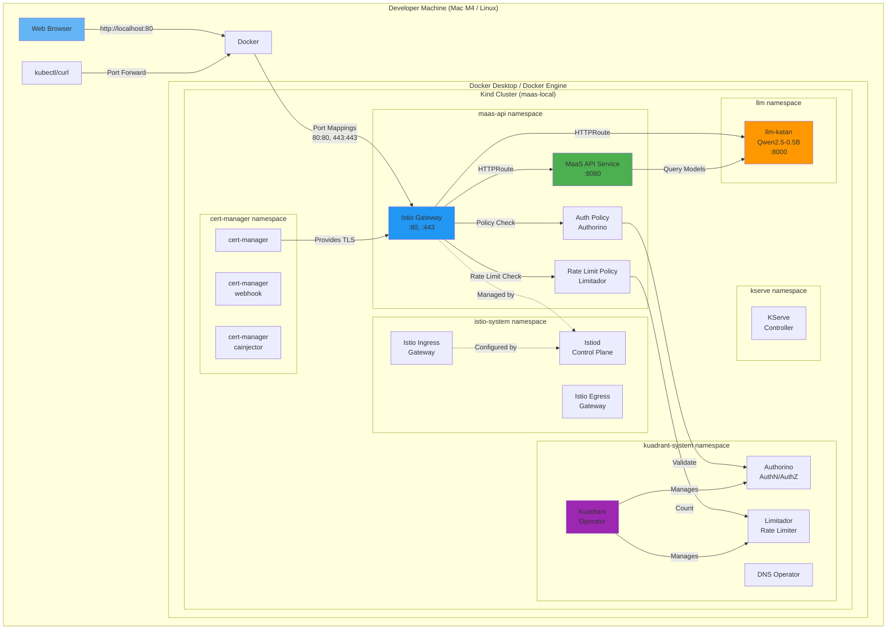

## Request Flow Architecture

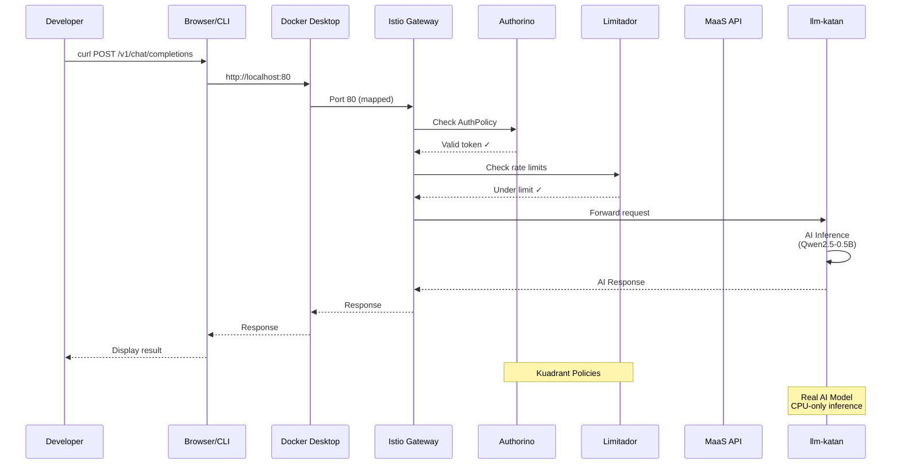

## Component Dependency Graph

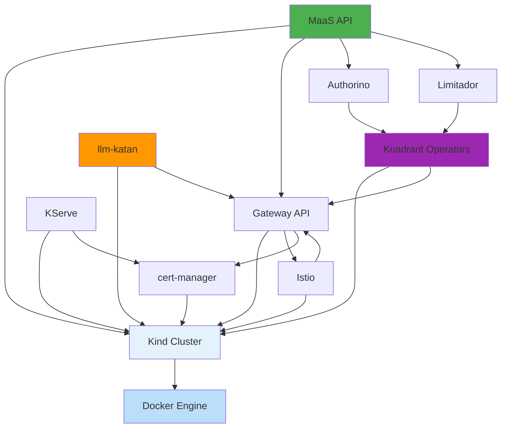

## Deployment Layers

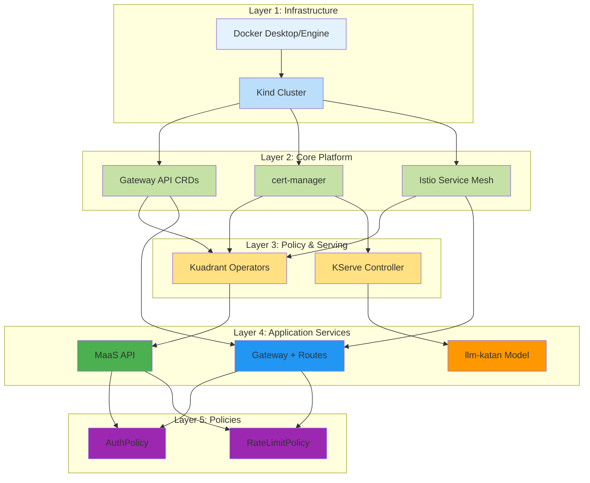

## Network Traffic Flow

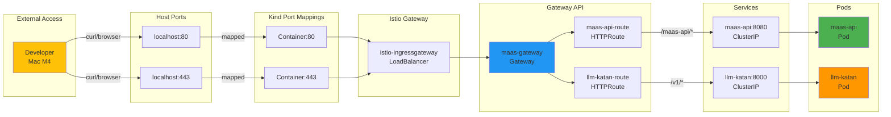

## Pod Distribution

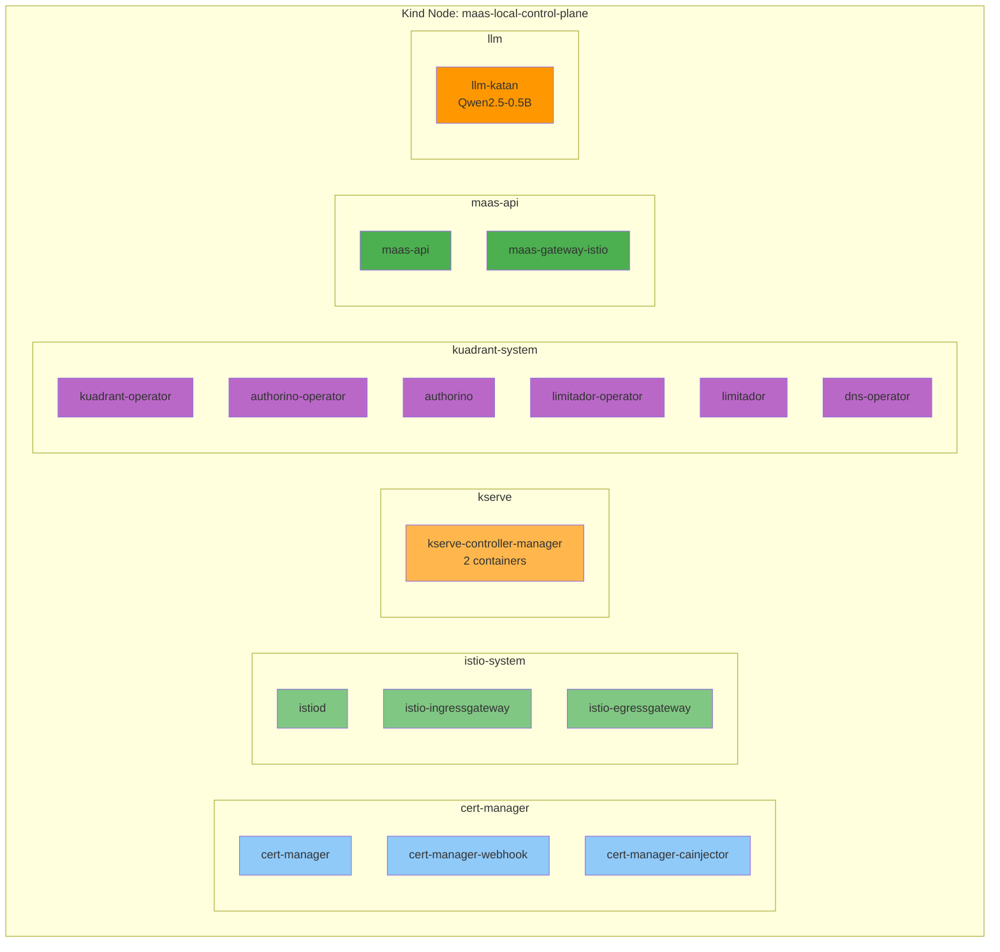

## Policy Enforcement Flow

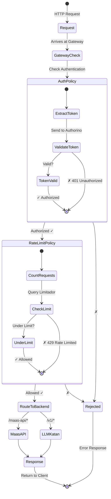

## Resource Hierarchy

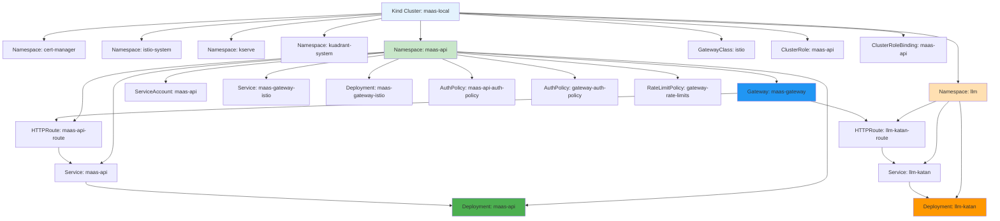

## Kustomize Overlay Structure

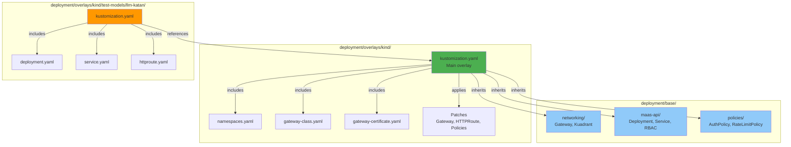

## Setup Flow

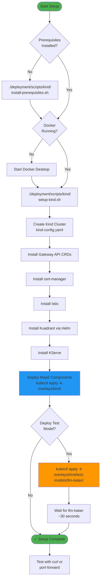

## Legend

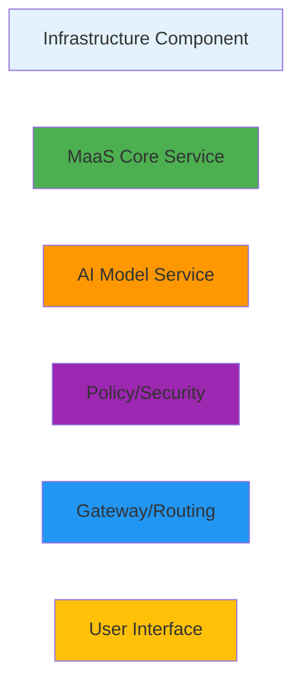

---

## Quick Reference

### Access Points
- **Browser/CLI**: `http://localhost:80`
- **HTTPS**: `https://localhost:443`
- **MaaS API**: `http://localhost/maas-api/v1/`
- **llm-katan**: `http://localhost/v1/chat/completions`

### Key Resources
- **Cluster Name**: `maas-local`
- **Namespaces**: `maas-api`, `llm`, `istio-system`, `kuadrant-system`, `kserve`, `cert-manager`
- **Total Pods**: 17 pods across 6 namespaces

### Port Mappings
| Host Port | Container Port | Service |
|-----------|----------------|---------|
| 80 | 80 | HTTP Gateway |
| 443 | 443 | HTTPS Gateway |

### Resource Requirements
- **CPU**: 4 cores recommended
- **Memory**: 8GB minimum, 16GB recommended
- **Disk**: 20GB free space

## KServe Architecture

The Kind setup includes **full KServe support with Knative Serving**, providing a production-like environment that matches the OpenShift deployment architecture.

### Why KServe + Knative?

**In Production (OpenShift):**
- Models are deployed as KServe `InferenceService` resources
- MaaS API discovers models by querying KServe InferenceServices
- Automatic scaling, versioning, and traffic management

**In Kind (Local Development):**
- Same architecture as production
- Models can be deployed as `InferenceService` (production-like) or plain Deployments (simpler)
- MaaS API supports both discovery mechanisms
- Full integration testing before deploying to production

### Components

| Component | Version | Purpose |
|-----------|---------|---------|
| **Knative Serving** | v1.10.1 | Serverless platform for KServe with auto-scaling |
| **KServe** | v0.11.0 | Model serving orchestration |
| **Istio** | minimal profile | Service mesh and networking |

### KServe Request Flow

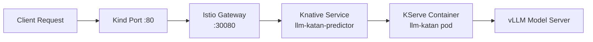

### InferenceService vs Plain Deployment

**Plain Deployment (simpler, used for llm-katan):**
```yaml
apiVersion: apps/v1
kind: Deployment  # Manual deployment
---
apiVersion: v1
kind: Service  # Manual service
---
apiVersion: gateway.networking.k8s.io/v1
kind: HTTPRoute  # Manual routing
```

**InferenceService (production-like, optional):**
```yaml
apiVersion: serving.kserve.io/v1beta1
kind: InferenceService
metadata:
  name: llm-katan
spec:
  predictor:
    containers:
    - name: kserve-container
      image: ghcr.io/.../llm-katan:latest
```

**KServe automatically creates:**
- ✅ Knative Service
- ✅ Kubernetes Deployment
- ✅ Service endpoints
- ✅ Auto-scaling configuration
- ✅ Traffic routing

