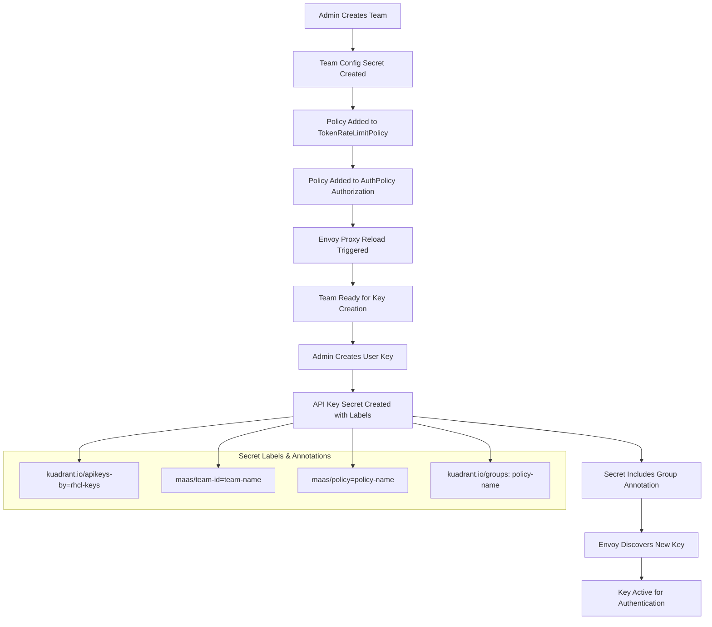
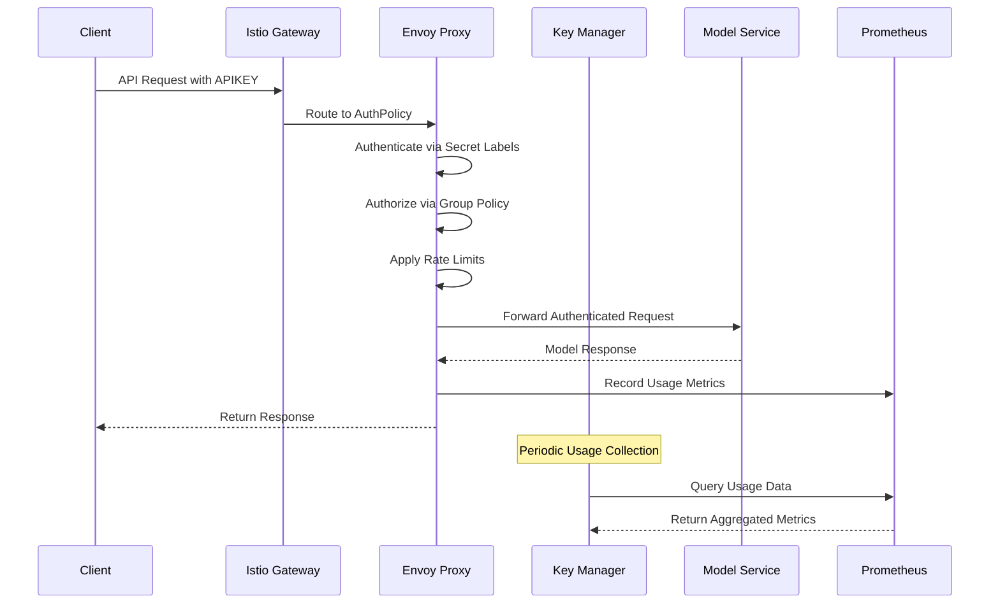

# MaaS Key Manager Architecture

**For a live demo see the [Key Manager Quickstart](./README.md)**

## Overview

Enables team-based API key management system that integrates with Kuadrant for authentication, authorization, and rate
limiting. It provides multi-tenant access control for the KServe inference services plus resource usage metrics.

## API Endpoint Reference

| Endpoint                 | Method | Purpose                                    | Request Body            | Response                      |
|--------------------------|--------|--------------------------------------------|-------------------------|-------------------------------|
| `/health`                | GET    | Service health check                       | None                    | Health status                 |
| `/generate_key`          | POST   | Legacy API key generation                  | `{"user_id": "string"}` | API key details               |
| `/delete_key`            | DELETE | Legacy API key deletion                    | `{"key": "string"}`     | Success confirmation          |
| `/models`                | GET    | List available AI models                   | None                    | OpenAI-compatible models list |
| `/teams`                 | POST   | Create new team with policy                | Team config             | Team details                  |
| `/teams`                 | GET    | List all teams                             | None                    | Array of team summaries       |
| `/teams/{team_id}`       | GET    | Get team details and configuration         | None                    | Complete team info            |
| `/teams/{team_id}`       | PATCH  | Update team configuration                  | Team updates            | Updated team                  |
| `/teams/{team_id}`       | DELETE | Delete team and all resources              | None                    | Success confirmation          |
| `/teams/{team_id}/keys`  | POST   | Create team-scoped API key                 | User config             | API key with team context     |
| `/teams/{team_id}/keys`  | GET    | List all team API keys                     | None                    | Array of team API keys        |
| `/teams/{team_id}/usage` | GET    | Get team usage metrics with user breakdown | None                    | Team usage statistics         |
| `/keys/{key_name}`       | DELETE | Delete specific API key                    | None                    | Success confirmation          |
| `/users/{user_id}/keys`  | GET    | List all user keys across teams            | None                    | Array of user API keys        |
| `/users/{user_id}/usage` | GET    | Get user usage metrics across all teams    | None                    | User usage statistics         |

## Core Architecture Components

### 1. Key Manager Service

- **Language**: Go with Gin framework
- **Purpose**: Central API management service
- **Features**:
    - Team-based API key generation
    - Policy-driven rate limiting
    - Usage metrics collection
    - Multi-tenant isolation

### 2. Kuadrant Integration

- **AuthPolicy**: Handles authentication and authorization
- **TokenRateLimitPolicy**: Enforces usage limits per team/user
- **Gateway**: Istio Gateway with Envoy proxy for traffic management

### 3. KServe Model Services

- **InferenceService CRs**: Deploy AI models
- **Model Discovery**: Automatic model listing from KServe resources
- **Traffic Routing**: Through Istio Gateway to model endpoints

## Team Creation and Key Management Workflow



## Detailed Component Workflows

### Team Creation Process

1. **Team Configuration Secret Creation**
    - Creates `team-{team_id}-config` secret in `llm` namespace
    - Contains team metadata and policy association
    - Labels: `maas/resource-type=team-config`, `maas/team-id={team_id}`
    - Annotations: `maas/policy={policy_name}`, `maas/team-name={team_name}`

2. **Policy Integration**
    - Adds new limit section to `TokenRateLimitPolicy`
    - Updates `AuthPolicy` authorization rules
    - Policy name becomes the group identifier for rate limiting

3. **Kuadrant Reload Requirements**
    - **AuthPolicy changes**: Immediate effect (hot reload)
    - **TokenRateLimitPolicy changes**: Requires Envoy proxy restart
    - **New API keys**: Discovered within 5-10 seconds via watch

### API Key Creation Process

1. **Secret Generation**
    - Creates `apikey-{user_id}-{team_id}-{hash}` secret
    - Contains base64-encoded API key
    - Applies critical labels and annotations for Kuadrant discovery

2. **Key Labels and Annotations**
   ```yaml
   labels:
     app: llm-gateway                           # Kuadrant selector
     kuadrant.io/apikeys-by: rhcl-keys         # Kuadrant discovery
     kuadrant.io/auth-secret: "true"           # Auth enablement
     maas/team-id: test-team                   # Team association
     maas/user-id: testuser                    # User association
     maas/policy-test-tokens: "true"           # Policy marker

   annotations:
     kuadrant.io/groups: test-tokens           # Rate limit group
     maas/policy: test-tokens                  # Policy reference
     secret.kuadrant.io/user-id: testuser      # Identity mapping
   ```

3. **Kuadrant Integration Points**
    - **Authentication**: `app=llm-gateway` label enables discovery
    - **Authorization**: `kuadrant.io/groups` annotation defines group membership
    - **Rate Limiting**: Group name matches TokenRateLimitPolicy limits
    - **Identity**: `secret.kuadrant.io/user-id` provides user context

## Kuadrant Policy Configuration

### AuthPolicy Structure
```yaml
authentication:
  api-key-users-apikey:
    apiKey:
      allNamespaces: true
      selector:
        matchLabels:
          app: llm-gateway           # Discovers all API key secrets
    credentials:
      authorizationHeader:
        prefix: APIKEY

authorization:
  allow-groups:
    opa:
      rego: |
        groups := split(object.get(input.auth.identity.metadata.annotations, "kuadrant.io/groups", ""), ",")
        allow { groups[_] == "test-tokens" }    # Allow specific groups
        allow { groups[_] == "premium" }
        allow { groups[_] == "enterprise" }

response:
  success:
    filters:
      identity:
        json:
          properties:
            groups:
              selector: auth.identity.metadata.annotations.kuadrant\.io/groups
            userid:
              selector: auth.identity.metadata.annotations.secret\.kuadrant\.io/user-id
```

### TokenRateLimitPolicy Structure

```yaml
limits:
  test-tokens:                    # Matches group from API key annotation
    counters:
    - expression: auth.identity.userid
    rates:
    - limit: 200
      window: 1m
    when:
    - predicate: auth.identity.groups.split(",").exists(g, g == "test-tokens")
```

## Model Discovery and Listing

### KServe Integration
- **InferenceService CRs**: Deployed in `llm` namespace
- **Model Discovery**: Key Manager queries KServe resources
- **OpenAI Compatibility**: Converts KServe models to OpenAI format
- **Dynamic Updates**: Real-time model availability

### Model Listing Process
1. Query KServe InferenceService CRDs
2. Extract model names and metadata
3. Convert to OpenAI-compatible format
4. Return structured model list

## Usage Metrics and Monitoring

### Prometheus Metrics Collection
- **Source**: Istio Envoy proxy metrics endpoint
- **Format**: Custom metrics with user/group embedding
- **Collection**: Direct HTTP requests from Key Manager

### Metric Structure

```
token_usage_with_user_and_group__user___testuser___group___test_tokens___namespace__llm{} 1003
authorized_calls_with_user_and_group__user___testuser___group___test_tokens___namespace__llm{} 15
limited_calls_with_user_and_group__user___testuser___group___test_tokens___namespace__llm{} 2
```

### Usage Data Processing

1. **Collection**: HTTP GET to Envoy metrics endpoint
2. **Parsing**: Regex extraction of user/group/metric type
3. **Aggregation**: Team and user-level summaries
4. **Enrichment**: Team names and user emails from secrets

### Usage Analytics Features

- **User Usage**: Cross-team aggregated statistics for the user (may have keys across teams)
- **Team Usage**: User breakdown within team
- **Real-time Data**: Direct Prometheus metrics

## System Integration Flow



