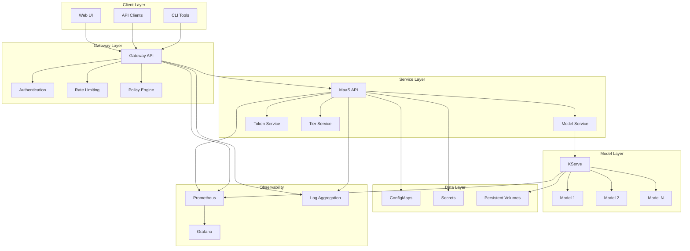
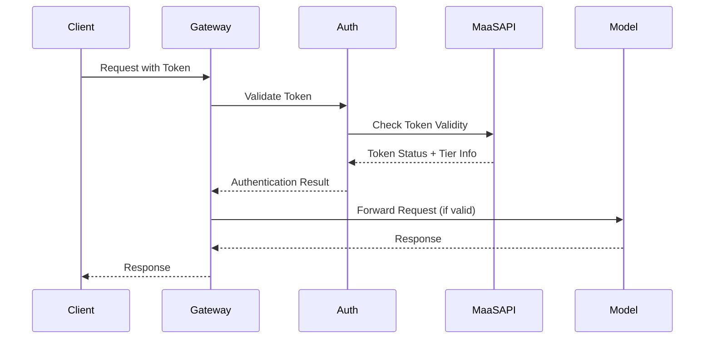
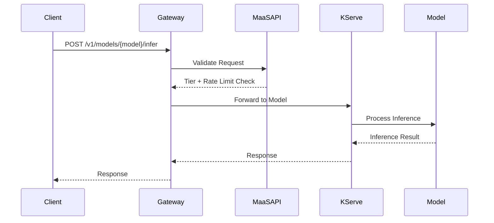

# MaaS Platform Architecture

## Overview

The MaaS Platform is designed as a cloud-native, Kubernetes-based solution that provides policy-based access control, rate limiting, and tier-based subscriptions for AI model serving. The architecture follows microservices principles and leverages OpenShift/Kubernetes native components for scalability and reliability.

## 🏗️ High-Level Architecture

## 🔄 Request Flow

### 1. Authentication Flow

### 2. Model Inference Flow

## Core Components

### Gateway Layer

The gateway layer handles all incoming requests and implements security policies:

- **Gateway API**: Routes requests to appropriate services
- **Kuadrant**: Policy Attachment Point for authentication and authorization
- **Authorino**: Authentication and authorization service
- **Limitador**: Token and Request Rate limiting service

### Management Layer

The management layer contains the core business logic:

- **MaaS API**: Central service for token and tier management

### Model Layer

The model layer provides AI model serving capabilities:

- **KServe**: Model serving platform
- **Model Instances**: Individual AI models (LLMs, etc.)
- **Scaling**: Automatic scaling based on demand

## Flows

### 1. Token Request Flow

<TBD>

### 2. Model Inference Flow

<TBD>
