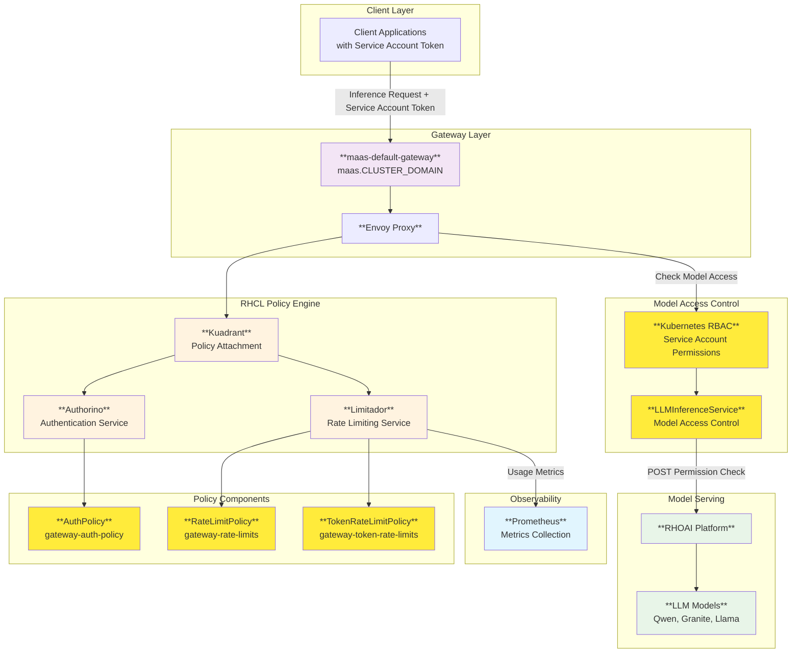

# MaaS Platform Architecture

## Overview

The MaaS Platform is designed as a cloud-native, Kubernetes-based solution that provides policy-based access control, rate limiting, and tier-based subscriptions for AI model serving. The architecture follows microservices principles and leverages OpenShift/Kubernetes native components for scalability and reliability.

## Architecture

### 🏗️ High-Level Architecture

The MaaS Platform is an end-to-end solution that leverages Kuadrant (Red Hat Connectivity Link) and Open Data Hub (Red Hat OpenShift AI)'s Model Serving capabilities to provide a fully managed, scalable, and secure self-service platform for AI model serving.

### Architecture Details

The MaaS Platform architecture is designed to be modular and scalable. It is composed of the following components:

- **MaaS API**: The central component for token generation and management.
- **Gateway API**: The entry point for all inference requests.
- **Kuandrant (Red Hat Connectivity Link)**: The policy engine for authentication and authorization.
- **Open Data Hub (Red Hat OpenShift AI)**: The model serving platform.

### Detailed Component Architecture

#### MaaS API Component Details

The MaaS API provides a self-service platform for users to request tokens for their inference requests. By leveraging Kubernetes native objects like ConfigMaps and ServiceAccounts, it offers model owners a simple way to configure access to their models based on a familiar group-based access control model.

**Key Features:**

- **Tier-to-Group Mapping**: Uses ConfigMap in the same namespace as MaaS API to map Kubernetes groups to tiers
- **Configurable Tiers**: Out of the box, the MaaS Platform comes with three default tiers: free, premium, and enterprise. These tiers are configurable and can be extended to support more tiers as needed.
- **Service Account Tokens**: Generates tokens for the appropriate tier's service account based on user's group membership
- **Future Enhancements**: Planned improvements for more sophisticated token management and the ability to integrate with external identity providers.

#### Inference Service Component Details

Once a user has obtained their token through the MaaS API, they can use it to make inference requests to the Gateway API. RHCL's Application Connectivity Policies then validate the token and enforce access control and rate limiting policies:

**Policy Engine Flow:**

1. **User Request**: A user makes an inference request to the Gateway API with a valid token.
2. **Service Account Authentication**: Authorino validates service account tokens using gateway-auth-policy
3. **Rate Limiting**: Limitador enforces usage quotas per tier/user using gateway-rate-limits and gateway-token-rate-limits
4. **Model Access Control**: RBAC checks if service account has POST access to the specific LLMInferenceService
5. **Request Forwarding**: Only requests with proper model access are forwarded to RHOAI
6. **Metrics Collection**: Limitador sends usage data to Prometheus for observability dashboards

## 🔄 Component Flows

### 1. Token Retrieval Flow (MaaS API)

The MaaS API generates service account tokens based on user group membership and tier configuration:

### 3. Model Inference Flow

The inference flow routes validated requests to RHOAI models:

The Gateway API and RHCL components validate service account tokens and enforce policies:

