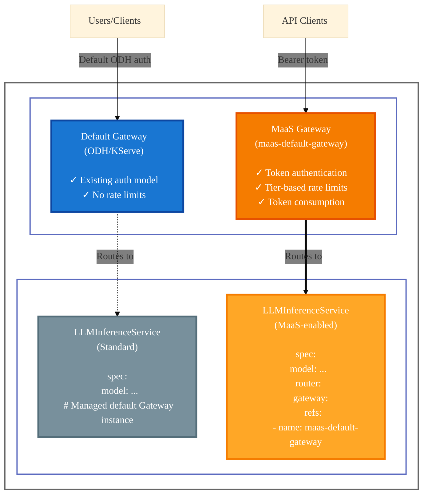

# Model Setup Guide

This guide explains how to configure `LLMInferenceService` resources to be picked up by the MaaS platform for authentication, rate limiting, and token-based consumption tracking.

## Gateway Architecture

The MaaS platform uses a **segregated gateway approach**, where models explicitly opt-in to MaaS capabilities by referencing the `maas-default-gateway`. This provides flexibility and isolation between different model deployment scenarios.



!!! note
    The `maas-default-gateway` is created automatically during MaaS platform installation. You don't need to create it manually.

### Benefits

- **Flexibility**: Different models can have different security and access requirements
- **Progressive Adoption**: Teams can adopt MaaS features incrementally
- **Production Control**: Production models get full policy enforcement if needed
- **Multi-Tenancy**: Different teams can use different gateways in the same cluster
- **Blast Radius Containment**: Issues with one gateway don't affect the other

## Prerequisites

Before configuring a model for MaaS, ensure you have:

- **MaaS platform installed** with `maas-default-gateway` deployed
- **LLMInferenceService** resource created or planned
- **Cluster admin** or equivalent permissions to modify `LLMInferenceService` resources

## Configuring Models for MaaS

To make your model available through the MaaS platform, you need to:

1. **Reference the maas-default-gateway** in your `LLMInferenceService` spec
2. **Add the tier annotation** to enable automatic RBAC setup

### Step 1: Add Gateway Reference

Configure your `LLMInferenceService` to use the `maas-default-gateway` by adding the gateway reference in the `router` section:

```yaml
apiVersion: serving.kserve.io/v1alpha1
kind: LLMInferenceService
metadata:
  name: my-production-model
  namespace: llm
spec:
  model:
    uri: hf://Qwen/Qwen3-0.6B
    name: Qwen/Qwen3-0.6B
  replicas: 1
  
  # Connect to MaaS-enabled gateway
  router:
    route: { }
    gateway:
      refs:
        - name: maas-default-gateway
          namespace: openshift-ingress
  
  template:
    # ... container configuration ...
```

**Key Points:**

- The `router.gateway.refs` field specifies which gateway to use
- Use `name: maas-default-gateway` and `namespace: openshift-ingress`
- **Without this specification**, the model uses the default KServe gateway and **is not subject to MaaS policies**

### Step 2: Configure Tier Access with Annotation

Add the `alpha.maas.opendatahub.io/tiers` annotation to enable automatic RBAC setup for tier-based access:

```yaml
apiVersion: serving.kserve.io/v1alpha1
kind: LLMInferenceService
metadata:
  name: my-production-model
  namespace: llm
  annotations:
    alpha.maas.opendatahub.io/tiers: '[]'
spec:
  # ... rest of spec ...
```

**Annotation Values:**

- **Empty list `[]`**: Grants access to **all tiers** (recommended for most models)
- **List of tier names**: Grants access to specific tiers only
  - Example: `'["premium","enterprise"]'` - only premium and enterprise tiers can access
- **Missing annotation**: **No tiers** have access by default (model won't be accessible via MaaS)

**Examples:**

Allow all tiers:

```yaml
annotations:
  alpha.maas.opendatahub.io/tiers: '[]'
```

Allow specific tiers:

```yaml
annotations:
  alpha.maas.opendatahub.io/tiers: '["premium","enterprise"]'
```

### What the Annotation Does

This annotation automatically creates the necessary RBAC resources (Roles and RoleBindings) that allow tier-specific service accounts to POST to your `LLMInferenceService`. The ODH Controller handles this automatically when the annotation is present.

Behind the scenes, it creates:

- **Role**: Grants `POST` permission on `llminferenceservices` resource
- **RoleBinding**: Binds tier service account groups (e.g., `system:serviceaccounts:maas-default-gateway-tier-premium`) to the role

### Complete Example

Here's a complete example of a MaaS-enabled model:

```yaml
apiVersion: serving.kserve.io/v1alpha1
kind: LLMInferenceService
metadata:
  name: qwen3-model
  namespace: llm
  annotations:
    alpha.maas.opendatahub.io/tiers: '[]'
spec:
  model:
    uri: hf://Qwen/Qwen3-0.6B
    name: Qwen/Qwen3-0.6B
  replicas: 1
  router:
    route: { }
    gateway:
      refs:
        - name: maas-default-gateway
          namespace: openshift-ingress
  template:
    containers:
      - name: main
        image: "vllm/vllm-openai:latest"
        resources:
          limits:
            nvidia.com/gpu: "1"
            memory: 12Gi
          requests:
            nvidia.com/gpu: "1"
            memory: 8Gi
```

## Updating Existing Models

To convert an existing model to use MaaS:

### Method 1: Patch the Model

```bash
kubectl patch llminferenceservice my-production-model -n llm --type='json' -p='[
  {
    "op": "add",
    "path": "/spec/router/gateway/refs/-",
    "value": {
      "name": "maas-default-gateway",
      "namespace": "openshift-ingress"
    }
  }
]'

# Add the tier annotation
kubectl annotate llminferenceservice my-production-model -n llm \
  alpha.maas.opendatahub.io/tiers='[]' \
  --overwrite
```

### Method 2: Edit the Resource

```bash
kubectl edit llminferenceservice my-production-model -n llm
```

Then add:

- Gateway reference in `spec.router.gateway.refs`
- Annotation `alpha.maas.opendatahub.io/tiers` in `metadata.annotations`

## Verification

After configuring your model, verify it's accessible through MaaS:

**1. Check the model appears in the models list:**

```bash
# Get your MaaS token first, then:
curl -sSk ${HOST}/maas-api/v1/models \
    -H "Content-Type: application/json" \
    -H "Authorization: Bearer $TOKEN" | jq .
```

**2. Verify the model status:**

```bash
kubectl get llminferenceservice my-production-model -n llm
```

**3. Check RBAC was created (if using tier annotation):**

```bash
kubectl get roles,rolebindings -n llm | grep my-production-model
```

**4. Test inference request:**

```bash
# Use the MODEL_URL from the models list
curl -sSk -H "Authorization: Bearer $TOKEN" \
  -H "Content-Type: application/json" \
  -d '{"model": "my-production-model", "prompt": "Hello", "max_tokens": 50}' \
  "${MODEL_URL}"
```

## Troubleshooting

### Model Not Appearing in /maas-api/v1/models

- Verify the gateway reference is correct: `name: maas-default-gateway`, `namespace: openshift-ingress`
- Check that the model's status shows it's ready
- Ensure the model namespace is accessible (some configurations may restrict discovery)

### 401 Unauthorized When Accessing Model

- Verify the tier annotation is set: `alpha.maas.opendatahub.io/tiers: '[]'` (or specific tiers)
- Check that your token's tier matches one of the tiers allowed in the annotation
- Verify RBAC resources were created: `kubectl get roles,rolebindings -n <model-namespace>`

### 403 Forbidden When Accessing Model

- Ensure the tier annotation includes your tier
- Check that RBAC was properly created for your tier
- Verify the service account in your token has the correct tier namespace

!!!Warning "Removing Models from Tiers During Active Usage"
    When updating the `alpha.maas.opendatahub.io/tiers` annotation to remove a tier, be aware that active requests may be affected. See [Model Tier Access Behavior](./model-access-behavior.md#model-tier-access-changes-during-active-usage) for details on expected behaviors and recommended practices.

## References

- [Tier Management](./tier-overview.md) - Learn about configuring tier access
- [Tier Configuration](./tier-configuration.md) - Detailed tier setup instructions
- [Model Tier Access Behavior](./model-access-behavior.md) - Expected behaviors and operational considerations
- [Architecture Overview](../architecture.md) - Understand the overall MaaS architecture
- [KServe LLMInferenceService Documentation](https://kserve.github.io/website/) - Official KServe documentation
