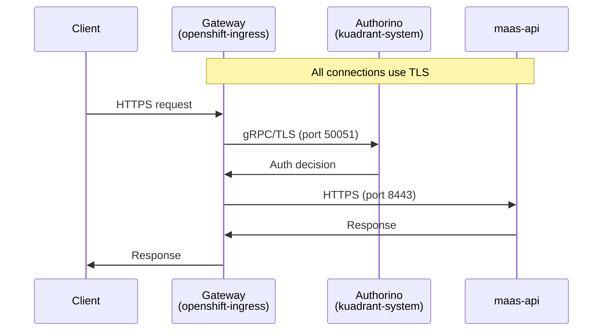

# TLS Configuration

This guide covers TLS configuration for the MaaS API component to enable encrypted communication for all API traffic.

## Overview

The MaaS API supports end-to-end TLS encryption across all traffic paths:



When TLS is enabled:

- External API traffic is encrypted from client to backend
- Internal authentication traffic (Authorino → `maas-api`) is encrypted
- All certificate validation uses a trusted CA bundle

!!! note "Default deployment"
    TLS is enabled by default when deploying via `deploy-openshift.sh` or using the `odh` overlay (used by ODH/RHOAI operator). Both rely on OpenShift [service-ca-operator](https://docs.openshift.com/container-platform/latest/security/certificates/service-serving-certificate.html) for automatic certificate provisioning.

## Prerequisites

### Authorino TLS Configuration

Authorino handles two TLS-protected traffic flows: 

* **inbound** from the Gateway (listener TLS) 
* **outbound** to `maas-api` (for metadata lookups). 

For ODH/RHOAI deployments, the inbound flow is a [platform pre-requisite](https://github.com/opendatahub-io/kserve/tree/release-v0.15/docs/samples/llmisvc/ocp-setup-for-GA#ssl-authorino) for secure `LLMInferenceService` communication; only the outbound configuration is needed for MaaS. 

For standalone deployments using `deploy-openshift.sh`, both flows are configured automatically via `configure-authorino-tls.sh`.

#### Gateway → Authorino (Listener TLS)

Enables TLS on Authorino's gRPC listener for incoming authentication requests from the Gateway.

```bash
# Annotate service for certificate generation
kubectl annotate service authorino-authorino-authorization \
  -n kuadrant-system \
  service.beta.openshift.io/serving-cert-secret-name=authorino-server-cert \
  --overwrite

# Patch Authorino CR to enable TLS listener
kubectl patch authorino authorino -n kuadrant-system --type=merge --patch '
{
  "spec": {
    "listener": {
      "tls": {
        "enabled": true,
        "certSecretRef": {
          "name": "authorino-server-cert"
        }
      }
    }
  }
}'
```

For more details, see the [ODH KServe TLS setup guide](https://github.com/opendatahub-io/kserve/tree/release-v0.15/docs/samples/llmisvc/ocp-setup-for-GA#ssl-authorino).

##### Configuring the Gateway for Authorino TLS

When TLS is enabled on Authorino's listener, the Gateway must be configured to trust Authorino's certificate. Without service mesh sidecars (the default for OpenShift Ingress), this requires an EnvoyFilter to configure the upstream TLS context.

For MaaS gateways managed by the ODH Model Controller, use the `security.opendatahub.io/authorino-tls-bootstrap` annotation to enable automatic EnvoyFilter creation:

```yaml
apiVersion: gateway.networking.k8s.io/v1
kind: Gateway
metadata:
  name: maas-default-gateway
  namespace: openshift-ingress
  annotations:
    security.opendatahub.io/authorino-tls-bootstrap: "true"
    opendatahub.io/managed: "false"  # Custom AuthPolicies managed externally
spec:
  # ... gateway spec ...
```

| Annotation | Description |
|------------|-------------|
| `security.opendatahub.io/authorino-tls-bootstrap` | When `"true"`, creates the EnvoyFilter for Gateway → Authorino TLS communication |
| `opendatahub.io/managed` | When `"false"`, disables automatic AuthPolicy creation (for custom policy management) |

!!! info "Interim solution"
    This annotation is an interim solution until [CONNLINK-528](https://issues.redhat.com/browse/CONNLINK-528) ships native support for configuring TLS between the Gateway and Authorino without mesh sidecars. Previously, setting `opendatahub.io/managed=false` would skip both AuthPolicy and EnvoyFilter creation, leaving no way to configure Authorino TLS independently. The `authorino-tls-bootstrap` annotation decouples these concerns, allowing TLS configuration even when AuthPolicies are managed externally.

#### Authorino → maas-api (Outbound TLS)

Enables Authorino to make HTTPS calls to `maas-api` for tier metadata lookups. Requires the cluster CA bundle and SSL environment variables.

```bash
# Configure SSL environment variables for outbound HTTPS
# Note: The Authorino CR doesn't support envVars, so we patch the deployment directly
kubectl -n kuadrant-system set env deployment/authorino \
  SSL_CERT_FILE=/etc/ssl/certs/openshift-service-ca/service-ca-bundle.crt \
  REQUESTS_CA_BUNDLE=/etc/ssl/certs/openshift-service-ca/service-ca-bundle.crt
```

!!! note
    OpenShift's service-ca-operator automatically populates the ConfigMap with the cluster CA certificate.

### Gateway → maas-api TLS (DestinationRule)

The `tls` overlay includes a DestinationRule to configure TLS origination from the gateway to `maas-api`.

**Why DestinationRule?** Gateway API's HTTPRoute doesn't tell Istio to use TLS when communicating with backends. Without [BackendTLSPolicy](https://gateway-api.sigs.k8s.io/api-types/backendtlspolicy/) (GA in Gateway API v1.4), an Istio-native DestinationRule is required to configure TLS origination.

```
Client → Gateway (TLS termination) → [DestinationRule] → maas-api:8443 (TLS origination)
```

!!! info "Future consideration"
    Once Gateway API v1.4+ with BackendTLSPolicy is supported by the Istio Gateway provider, the DestinationRule can be replaced with a standard Gateway API resource.

## Custom maas-api TLS Configuration

This section covers how `maas-api` is configured to use TLS certificates. These settings are automatically configured by the kustomize overlays; manual configuration is only needed for custom deployments or non-OpenShift environments.

### Environment Variables

The `maas-api` component accepts TLS configuration via environment variables:

| Variable | Description | Example |
|----------|-------------|---------|
| `TLS_CERT` | Path to TLS certificate file | `/etc/maas-api/tls/tls.crt` |
| `TLS_KEY` | Path to TLS private key file | `/etc/maas-api/tls/tls.key` |

When both variables are set, the API server listens on HTTPS (port 8443) instead of HTTP (port 8080).

### Volume Mounts

Certificates should be mounted as a volume from a Kubernetes Secret:

```yaml
spec:
  containers:
  - name: maas-api
    env:
    - name: TLS_CERT
      value: /etc/maas-api/tls/tls.crt
    - name: TLS_KEY
      value: /etc/maas-api/tls/tls.key
    volumeMounts:
    - name: tls-certs
      mountPath: /etc/maas-api/tls
      readOnly: true
  volumes:
  - name: tls-certs
    secret:
      secretName: maas-api-tls-cert
```

## Kustomize Overlays

Pre-configured overlays are available for common scenarios:

| Overlay | Description |
|---------|-------------|
| `deployment/base/maas-api/overlays/tls` | Base TLS overlay for maas-api (deployment patch, service annotation, DestinationRule) |
| `deployment/overlays/tls-backend` | Full TLS deployment with Authorino configuration |
| `deployment/overlays/tls-backend-disk` | TLS + persistent storage (PVC) |
| `deployment/overlays/http-backend` | HTTP only (development/testing) |

The `tls` base overlay includes:

| Resource | Purpose |
|----------|---------|
| `deployment-patch.yaml` | Configure maas-api container for TLS |
| `service-patch.yaml` | Add serving-cert annotation, expose port 8443 |
| `destinationrule.yaml` | Configure gateway TLS to maas-api backend |

Deploy using:

```bash
kustomize build deployment/overlays/tls-backend | kubectl apply -f -
```

## Verifying TLS Configuration

### Check Certificate

```bash
# View certificate details
kubectl get secret maas-api-serving-cert -n maas-api -o jsonpath='{.data.tls\.crt}' \
  | base64 -d | openssl x509 -text -noout

# Check expiry
kubectl get secret maas-api-serving-cert -n maas-api -o jsonpath='{.data.tls\.crt}' \
  | base64 -d | openssl x509 -enddate -noout
```

### Test HTTPS Endpoint

```bash
# From within the cluster
kubectl run curl --rm -it --image=curlimages/curl -- \
  curl -vk https://maas-api.maas-api.svc:8443/health

# Check certificate chain
openssl s_client -connect maas-api.maas-api.svc:8443 -servername maas-api.maas-api.svc
```

