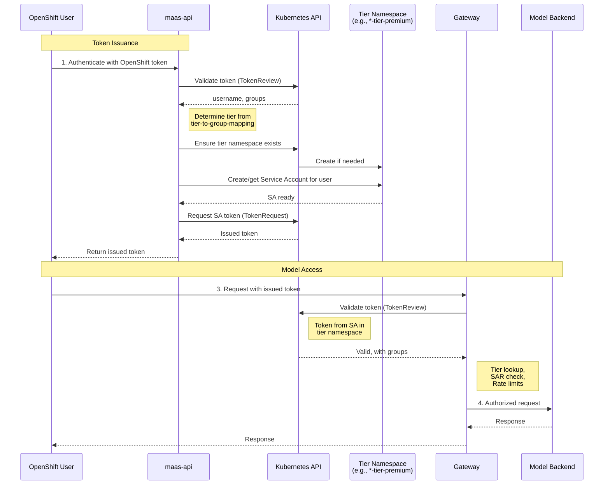
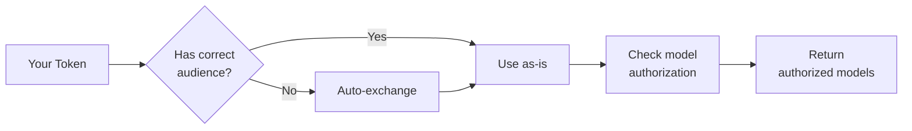

# Understanding Token Management

This guide explains the token-based authentication system used to access models in the tier-based access control system. 
It covers how token issuance works, the underlying service account architecture, and token lifecycle management.

!!! note
    **Prerequisites**: This document assumes you have already configured tiers, RBAC, and rate limits. 
    See [Configuring Subscription Tiers](tier-configuration.md) for setup instructions.

---

## Table of Contents

1. [Overview](#overview)
1. [How Token Issuance Works](#how-token-issuance-works)
1. [Model Discovery](#model-discovery)
1. [Practical Usage](#practical-usage)
1. [Token Lifecycle Management](#token-lifecycle-management)
1. [Frequently Asked Questions (FAQ)](#frequently-asked-questions-faq)
1. [Related Documentation](#related-documentation)

---

## Overview

The platform uses a secure, token-based authentication system. Instead of using your primary OpenShift credentials to 
access models directly, you first exchange them for a temporary, specialized access token. This approach provides several key benefits:

- **Enhanced Security**: Tokens are short-lived, reducing the risk of compromised credentials. They are also narrowly scoped for model access only.
- **Tier-Based Access Control**: The token you receive is automatically associated with your subscription tier (e.g., free, premium), ensuring you get the correct permissions and rate limits.
- **Auditability**: Every request made with a token is tied to a specific identity and can be audited.
- **Kubernetes-Native Integration**: The system leverages standard, Kubernetes authentication and authorization mechanisms.

The process is simple:

```text
You authenticate with OpenShift → Request a token from the API → Use that token to call models
```

---

## How Token Issuance Works

When you request a token, you are essentially trading your long-term OpenShift identity for a short-term, 
purpose-built identity in the form of a Kubernetes Service Account.

### Key Concepts

- **Tier Namespace**: The platform maintains a separate Kubernetes namespace for each subscription tier (e.g., `...-tier-free`, `...-tier-premium`). These namespaces isolate users based on their access level. 
- **Service Account (SA)**: When you request a token for the first time, the system creates a Service Account that represents you inside your designated tier namespace. This SA inherits all the permissions assigned to that tier.
- **Access Token**: The token you receive is a standard JSON Web Token (JWT) that authenticates you as that specific Service Account. When you present this token to the gateway, the system knows your identity, your tier, and what permissions you have.
- **Token Audience**: The intended recipient of your token. This is validated during authentication and must match the gateway's configuration.
- **Token Expiration**: The time after which the token expires. Tokens are short-lived to reduce the risk of compromised credentials.

### Token Issuance Flow

This diagram illustrates the process of obtaining a token.



---

## Model Discovery

The `/v1/models` endpoint allows you to discover which models you're authorized to access. This endpoint works with any valid authentication token - you don't need to create an API key first.

### How It Works

When you call `/v1/models`, the system checks your authorization against each model's endpoint. If your token doesn't have the correct audience for these internal checks, the API automatically exchanges it for a short-lived service account token.



This means you can:

1. **Authenticate with OpenShift or OIDC** - use your existing identity
2. **Call `/v1/models` immediately** - see available models without creating an API key first

!!! info "Security Note"
    The token exchange is an internal implementation detail. Authentication is still fully handled by Authorino - 
    the API only peeks at the token's audience claim to decide if exchange is needed. Your identity always comes 
    from Authorino's validated headers, not from parsing the token.

---

## Practical Usage

For step-by-step instructions on obtaining and using tokens to access models, including practical examples and troubleshooting, see the [Self-Service Model Access Guide](../user-guide/self-service-model-access.md).

That guide provides:

- Complete walkthrough for getting your OpenShift token
- How to request an access token from the API
- Examples of making inference requests with your token
- Troubleshooting common authentication issues

---

## Token Lifecycle Management

Access tokens are ephemeral and must be managed accordingly.

### Token Expiration

Tokens have a finite lifetime for security purposes:

- **Default lifetime**: 4 hours (configurable when requesting)
- **Maximum lifetime**: Determined by your Kubernetes cluster configuration

When a token expires, any API request using it will fail with an `HTTP 401 Unauthorized error`. 
To continue, you must request a new token using the process described above.

**Tips:**

- For interactive use, request tokens with a lifetime that covers your session (e.g., 4h).
- For automated scripts or applications, implement logic to refresh the token proactively before it expires.

### Token Revocation

You can invalidate all active tokens associated with your user account. This is a key security feature if you believe a token has been exposed.

To revoke all your tokens, send a `DELETE` request to the `/v1/tokens` endpoint.

```shell
curl -sSk -X DELETE "${MAAS_API_URL}/v1/tokens" \
  -H "Authorization: Bearer $(oc whoami -t)"
```
This action immediately deletes your underlying Service Account, which invalidates all tokens that have ever been issued for it. 
The Service Account will be automatically recreated the next time you request a token.

!!! warning "Important"
    **For Platform Administrators**: Admins can manually revoke a user's tokens by finding and deleting their Service Account 
    in the appropriate tier namespace (e.g., `<instance-name>-tier-premium`). This is an effective way to immediately cut 
    off access for a specific user in response to a security event.

---

## Frequently Asked Questions (FAQ)

**Q: My tier is wrong or shows as "free". How do I fix it?**

A: Your tier is determined by your group membership in OpenShift. Contact your platform administrator to ensure you 
are in the correct user group, which should be mapped to your desired tier in the [tier mapping configuration](tier-configuration.md).

---

**Q: How long should my tokens be valid for?**

A: It's a balance of security and convenience. For interactive command-line use, 1-8 hours is common. For applications, request shorter-lived tokens (e.g., 15-60 minutes) and refresh them automatically.

---

**Q: Can I have multiple active tokens at once?**

A: Yes. Each call to the `/v1/tokens` endpoint issues a new, independent token. All of them will be valid until they expire or are revoked.

---

**Q: What happens if the `maas-api` service is down?**

A: You will not be able to issue *new* tokens. However, any existing, non-expired tokens will continue to work for calling models, as the gateway validates them directly with the Kubernetes API.

---

**Q: Can I use one token to access multiple different models?**

A: Yes. Your token grants you access based on your tier's RBAC permissions. If your tier is authorized to use multiple models, a single token will work for all of them.

---

**Q: What's the difference between my OpenShift token and an API key?**

A: Your **OpenShift token** is your identity token from authentication (e.g. OpenShift or OIDC). It proves who you are but may not have the correct audience for model access. An **API key** (issued via `/v1/tokens`) is a service account token with the correct audience and permissions for accessing models. You can use either to list models, but only API keys work for model inference.

---

**Q: Do I need an API key to list available models?**

A: No. You can call `/v1/models` with your OpenShift/OIDC token directly. The API automatically handles token exchange if needed. This lets you discover available models before deciding which API keys to create.

---

**Q: What is "token audience" and why does it matter?**

A: Token audience identifies the intended recipient of a token. Model endpoints expect tokens with a specific audience (`{tenant}-sa`). OpenShift/OIDC tokens have different audiences, so the API exchanges them internally when needed for authorization checks.

---

## Related Documentation

- **[Configuring Subscription Tiers](tier-configuration.md)**: For operators - tier setup, RBAC, and rate limiting configuration

---
