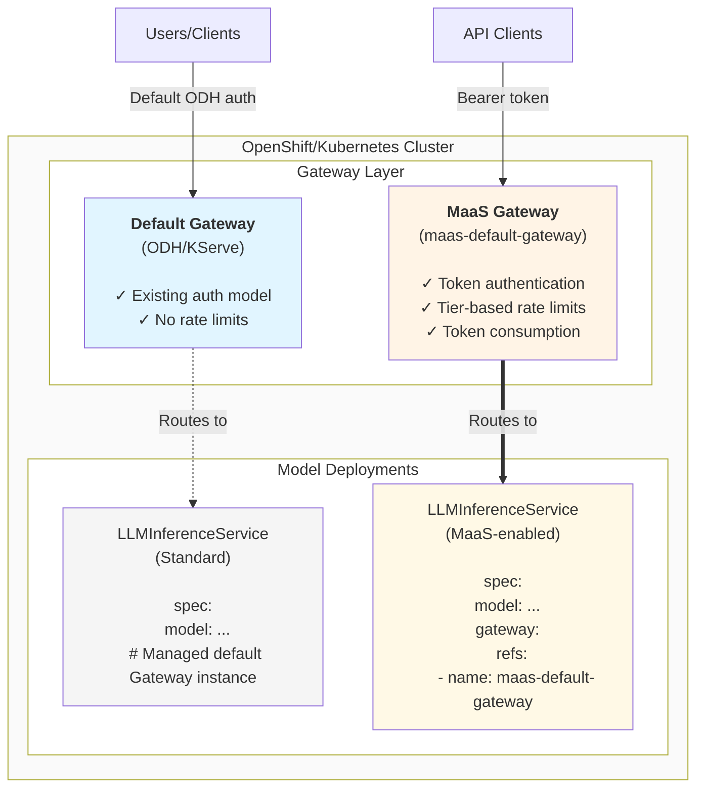

# MaaS Gateway Setup Guide

This guide explains how to set up a dedicated Gateway for Model-as-a-Service (MaaS) with authentication, rate limiting, and token-based consumption tracking.

## Overview

The MaaS platform follows a **segregated gateway approach**, where models explicitly opt-in to MaaS capabilities. 
This approach provides flexibility and isolation between different model deployment scenarios and existing ODH Models already used by customers.

### Gateway Architecture



## Why Gateway Segregation?

### Benefits

1. **Flexibility**: Different models can have different security and access requirements
2. **Progressive Adoption**: Teams can adopt MaaS features incrementally
3. **Development Freedom**: Dev/test models don't need authentication overhead
4. **Production Control**: Production models get full policy enforcement if needed
5. **Multi-Tenancy**: Different teams can use different gateways in the same cluster
6. **Blast Radius Containment**: Issues with one gateway don't affect the other

## Prerequisites

Before setting up the MaaS gateway, ensure you have:

- **OpenShift 4.19.9+**
- **Red Hat Connectivity Link/Red Hat Connectivity Link** installed (provides AuthPolicy, RateLimitPolicy, TokenRateLimitPolicy CRDs)
- **Cluster admin** or equivalent permissions
- **MaaS API** deployed (for tier lookup functionality)

!!! note
    For complete deployment prerequisites and platform-specific requirements, see the [Deployment Guide](../deployment/README.md).

## Step 1: Create GatewayClass

The GatewayClass defines which controller will manage the Gateway. On OpenShift, use the built-in gateway controller:

!!! note
    On OpenShift 4.19.9+, the GatewayClass is automatically available. On earlier versions, you may need to enable Gateway API feature gates first.

```bash
kubectl apply -f - <<EOF
apiVersion: gateway.networking.k8s.io/v1
kind: GatewayClass
metadata:
  name: openshift-default
spec:
  controllerName: "openshift.io/gateway-controller/v1"
EOF
```

## Step 2: Create the MaaS Gateway

Create a dedicated Gateway for MaaS-enabled models. Key configuration points:

- **Name**: `maas-default-gateway` - This is what models will reference
- **Namespace**: `openshift-ingress` - Standard namespace for gateway infrastructure in Openshift
- **Labels**: Help identify the gateway and enable label-based queries
- **allowedRoutes.from: All** - Allows HTTPRoutes from any namespace to attach to this gateway

```bash
kubectl apply -f - <<EOF
apiVersion: gateway.networking.k8s.io/v1
kind: Gateway
metadata:
  name: maas-default-gateway
  namespace: openshift-ingress
  labels:
    app.kubernetes.io/name: maas
    app.kubernetes.io/instance: maas-default-gateway
    app.kubernetes.io/component: gateway
spec:
  gatewayClassName: openshift-default
  listeners:
    - name: http
      port: 80
      protocol: HTTP
      allowedRoutes:
        namespaces:
          from: All
EOF
```

**Verify the Gateway is ready:**

```shell
kubectl get gateway maas-default-gateway -n openshift-ingress
kubectl wait --for=condition=Programmed gateway maas-default-gateway -n openshift-ingress --timeout=300s
```

Expected output:
```text
NAME                   CLASS               ADDRESS        PROGRAMMED   AGE
maas-default-gateway   openshift-default   10.0.1.100     True         2m
```

## Step 3: Apply Gateway Policies

The MaaS gateway uses Red Hat Connectivity Link policies to enforce authentication, authorization, and rate limiting. Apply the following policies to enable MaaS capabilities:

### AuthPolicy - Authentication & Authorization

The AuthPolicy validates tokens, determines user tiers, and enforces access control:

```bash
kubectl apply -f deployment/base/policies/gateway-auth-policy.yaml
```

**What it does:**
- **Token Validation**: Verifies Kubernetes service account tokens with the correct audience (`maas-default-gateway-sa`)
- **Tier Lookup**: Queries the MaaS API to determine user's subscription tier based on their group membership
- **Access Control**: Uses Kubernetes RBAC to verify users have permission to access specific models
- **Identity Enrichment**: Injects user ID and tier information into requests for downstream policies

!!! note
    User tiers are determined by namespace membership. Service accounts in `maas-default-gateway-tier-{free|premium|enterprise}` namespaces automatically inherit the corresponding tier. See [Tiers Documentation](./tiers.md) for complete tier management details.

### RateLimitPolicy - Request Rate Limiting

The RateLimitPolicy limits the number of requests per user based on their tier:

```bash
kubectl apply -f deployment/base/policies/rate-limit-policy.yaml
```

**Default limits:**
- **Free tier**: 5 requests per 2 minutes
- **Premium tier**: 20 requests per 2 minutes
- **Enterprise tier**: 50 requests per 2 minutes

These limits prevent abuse and ensure fair resource allocation across users. See [Tiers Documentation](./tiers.md) for information on customizing tier limits.

### TokenRateLimitPolicy - Token Consumption Limiting

The TokenRateLimitPolicy tracks and limits the total number of LLM tokens consumed:

```bash
kubectl apply -f deployment/base/policies/token-limit-policy.yaml
```

**Default limits:**
- **Free tier**: 100 tokens per minute
- **Premium tier**: 50,000 tokens per minute
- **Enterprise tier**: 100,000 tokens per minute

This policy automatically extracts token usage from model responses (`usage.total_tokens` field) and enforces consumption limits. See [Tiers Documentation](./tiers.md) for tier-based billing and quota management.

### Verify Policy Status

After applying policies, verify they are accepted by the gateway:

```bash
kubectl get authpolicy gateway-auth-policy -n openshift-ingress
kubectl get ratelimitpolicy gateway-rate-limits -n openshift-ingress
kubectl get tokenratelimitpolicy gateway-token-rate-limits -n openshift-ingress
```

All policies should show `Accepted: True` in their status conditions.

## Step 4: Configure Models to Use MaaS Gateway

Models opt-in to MaaS by specifying the gateway in their LLMInferenceService spec:

```yaml
apiVersion: serving.kserve.io/v1alpha1
kind: LLMInferenceService
metadata:
  name: my-production-model
  namespace: llm
spec:
  model:
    uri: hf://Qwen/Qwen3-0.6B
    name: Qwen/Qwen3-0.6B
  replicas: 1
  
  # Opt-in to MaaS Gateway
  gateway:
    refs:
      - name: maas-default-gateway
        namespace: openshift-ingress
  
  # Router configuration (separate from gateway)
  router:
    route: { }
  
  template:
    # ... container configuration ...
```

**Without this gateway specification**, the model uses the default KServe gateway and **is not subject to MaaS policies**.

## Verification

Once you've completed the gateway setup, verify that everything is working correctly:

```bash
kubectl get gateway maas-default-gateway -n openshift-ingress
```

See the [Deployment Guide Testing section](../deployment/README.md#testing-the-deployment) and [Developer Guide](../maas-api/DEV.md#testing).

## References

### Gateway and Kubernetes

- [Gateway API Documentation](https://gateway-api.sigs.k8s.io/)
- [KServe LLMInferenceService](https://kserve.github.io/website/)

### Red Hat Connectivity Link Policies

- [Red Hat Connectivity Link Documentation](https://docs.kuadrant.io/)
- [AuthPolicy - Authentication & Authorization](https://docs.kuadrant.io/latest/kuadrant-operator/doc/auth/)
- [RateLimitPolicy - Request Rate Limiting](https://docs.kuadrant.io/latest/kuadrant-operator/doc/rate-limiting/)
- [Authorino - Authentication Service](https://docs.kuadrant.io/latest/authorino/)
- [Limitador - Rate Limiting Service](https://docs.kuadrant.io/latest/limitador/)

### MaaS Platform

- [Tiers Management](./tiers.md)
- [Deployment Guide](../deployment/README.md)


