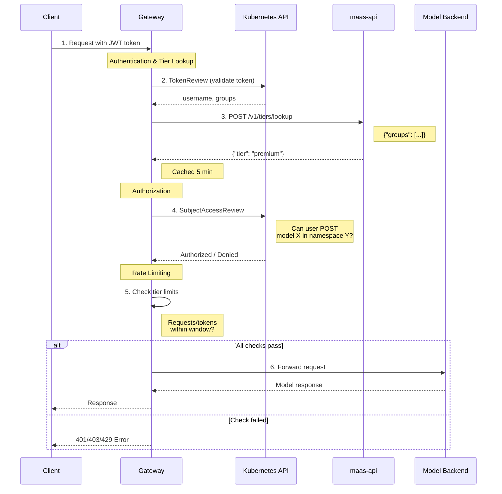

# Configuring Subscription Tiers

This guide explains how to configure subscription tiers for model access control, 
including tier-to-group mappings, authorization policies, and rate limiting. 

Tiers enable differentiated service levels (e.g., free, premium, enterprise) with varying access permissions and quotas.

!!! note
    **For token management**: This guide covers tier configuration from an operator perspective. 
    For information on how users obtain and use tokens, see [Token Management](token-management.md).

---

## Table of Contents

1. [Prerequisites](#prerequisites)
1. [Concepts Overview](#concepts-overview)
1. [Architecture: How Tiering Works](#architecture-how-tiering-works)
1. [Configuration Steps](#configuration-steps)
1. [Verifying Your Configuration](#verifying-your-configuration)
1. [Common Configuration Mistakes](#common-configuration-mistakes)
1. [Related Documentation](#related-documentation)

---

## Prerequisites

Before configuring tiers, ensure you have:

- **Openshift cluster** with Gateway API support
- **Kuadrant** for authentication, authorization and rate-limiting policies
- **maas-api service** deployed and operational
- **`kubectl` access** with cluster-admin or equivalent permissions

**Core concepts:**
- Kubernetes Role-Based Access Control (RBAC)
- Kubernetes Service Accounts and bound tokens
- Kubernetes TokenReview and SubjectAccessReview (SAR) APIs
- Gateway API resources
- Basic understanding of JWT authentication

---

## Concepts Overview

### Core Terminology

#### Tier  
A subscription level that determines class of service (e.g., `free`, `premium`, `enterprise`). 
Each tier maps to a set of Kubernetes groups and has an associated privilege level.

##### Level  
A numeric value indicating tier precedence. Higher numbers represent higher privilege. 
When a user belongs to multiple groups mapping to different tiers, the tier with the highest level is assigned.

##### Mapping  
Configuration, currently stored in a Kubernetes ConfigMap, that defines tiers and their associated Kubernetes groups. 
The mapping is used by `maas-api` and serves as the single source of truth for resolving user groups to tiers.

#### Instance Name

A unique identifier for a Model-as-a-Service component, typically matching the name of the Gateway resource (e.g., openshift-ai-inference). 
This name is used to ensure that configurations for different gateways do not conflict.

#### Tier Namespace  
A dedicated Kubernetes namespace for each tier, following the pattern `<instance-name>-tier-<tier-name>` (e.g., `openshift-ai-inference-tier-premium`).
Service accounts for users are created within their assigned tier's namespace. This design is fundamental to RBAC strategy, 
as it allows to grant permissions to all users of a specific tier by targeting the namespace's service accounts group (`system:serviceaccounts:<tier-namespace>`).

#### Tier Resolution & Identity Enrichment

* *Resolution:* `AuthPolicy` calls the maas-api `/v1/tiers/lookup` endpoint with the user's group memberships. `maas-api` uses the tier mapping to determine and return the appropriate tier.

* *Enrichment:* `AuthPolicy` attaches the resolved tier information to the request's internal metadata. The tier becomes available as `auth.identity.tier` for downstream policy evaluation (e.g., rate limiting).

#### SubjectAccessReview (SAR)  

A Kubernetes authorization mechanism that determines whether a user or service account can perform a specific action on a specific resource. 
The `AuthPolicy` uses SAR to enforce per-model access control.

#### Kubernetes Groups  
Identity attributes automatically assigned by Kubernetes or provided by external identity providers. Examples:
- `system:authenticated` - all authenticated users
- `system:serviceaccounts:<namespace>` - all service accounts in a namespace
- `premium-users` - custom group, e.g.from an OIDC/SAML provider

### Key Design Principles

1. **Group-Based Access**: Tiers are assigned based on Kubernetes group membership, not individual user assignments. This simplifies management by decoupling users from permissions.

1. **Namespace-Scoped RBAC**: Permissions are granted to tier namespaces, not individual service accounts. This allows Kubernetes-native RBAC to control which tiers can access which models.

1. **Dynamic Tier Resolution**: The gateway resolves a user's tier on each request (with caching), allowing for immediate changes in access if a user's group membership is updated.

1. **Per-Model Authorization**: RBAC checks occur at the model level (namespace + name), not gateway-wide

1. **Hierarchical Precedence**: When a user's groups map to multiple tiers, the tier with the highest `level` is always chosen, giving a predictable and clear privilege model.

---

## Architecture: How Tiering Works

### Request Flow Diagram



### How It Works

**1. Authentication & Tier Identification**
- Client sends request with JWT token
- Gateway validates token and extracts user's group memberships
- Gateway calls `maas-api` to determine tier based on groups
- Tier is cached for 5 minutes to improve performance
- The request context is enriched with the tier name (e.g., auth.identity.tier = "premium").

**2. Authorization**
- Gateway AuthPolicy checks if user can access the specific model
- Uses Kubernetes RBAC (per-model authorization)
- RoleBindings control which tier namespaces can access which models

**3. Rate Limiting**
- The gateway evaluates the RateLimitPolicy and enforces limits based on tier
- Both request-based and token-based limits apply
- Limits are per-user within each tier

**4. Request Processing**
- If all checks pass, gateway forwards request to model
- Model processes and returns response

For details on how users obtain and use tokens, see [Token Management](token-management.md).

---

## Configuration Steps

This section covers the configuration to enable tier-based access control.

### Tier Mapping

**What is tier mapping?**

Tier mapping connects Kubernetes groups to subscription tiers. When a user authenticates, they belong to one or more 
Kubernetes groups (e.g., `premium-users`, `system:authenticated`). The tier mapping determines which tier to assign based on these groups.

**Why is it needed?**

The mapping serves as the central policy that defines:
- Which user groups correspond to which service tier.
- The precedence (`level`) of each tier, which resolves ambiguity when a user belongs to multiple groups.
- The tier identifiers (`name`) that will be used in downstream policies like rate limiting.

**Example Configuration:**

```yaml
apiVersion: v1
kind: ConfigMap
metadata:
  name: tier-to-group-mapping
  namespace: maas-api
data:
  tiers: |
    - name: free
      description: Free tier for basic users
      level: 1
      groups:
      - system:authenticated
    - name: premium
      description: Premium tier
      level: 10
      groups:
      - premium-users
    - name: enterprise
      description: Enterprise tier
      level: 20
      groups:
      - enterprise-users
```

**Field Definitions:**
- `name` (required): Tier identifier (lowercase, alphanumeric)
- `description` (optional): Human-readable description
- `level` (required): Numeric precedence (higher = more privilege)
- `groups` (required): Kubernetes groups mapping to this tier

**Apply:**
```bash
kubectl apply -f tier-mapping-configmap.yaml
kubectl rollout restart deployment/maas-api -n maas-api
```
---

### Gateway AuthPolicy

The `AuthPolicy` is a Kuadrant custom resource that instructs the gateway how to handle authentication and authorization. 
It orchestrates the TokenReview, tier lookup, and SubjectAccessReview.

```yaml
apiVersion: kuadrant.io/v1
kind: AuthPolicy
metadata:
  name: gateway-auth-policy
  namespace: openshift-ingress
spec:
  targetRef:
    group: gateway.networking.k8s.io
    kind: Gateway
    name: openshift-ai-inference
  rules:
    metadata:
      # Enriching identity metadata with a proper subscription tier based on user groups
      matchedTier: # <1>
        http:
          url: http://maas-api.maas-api.svc.cluster.local:8080/v1/tiers/lookup
          contentType: application/json
          method: POST
          body:
            expression: |-
              { "groups": auth.identity.user.groups }
        cache:
          key:
            selector: auth.identity.user.username
          ttl: 300
    authentication: # <2>
      service-accounts:
        kubernetesTokenReview:
          audiences:
            - openshift-ai-inference-sa
        defaults:
          # token normalization - https://docs.kuadrant.io/1.2.x/authorino/docs/user-guides/token-normalization/
          # full username: system:serviceaccount:<ns>:<name>
          userid:
            expression: |
              auth.identity.user.username.split(":")[3]
    authorization: # <3>
      tier-access:
        kubernetesSubjectAccessReview:
          user:
            expression: auth.identity.user.username
          authorizationGroups:
            expression: auth.identity.user.groups
          resourceAttributes:
            group:
              value: serving.kserve.io
            resource:
              value: llminferenceservices
            namespace:
              expression: |
                request.path.split("/")[1]
            name:
              expression: |
                request.path.split("/")[2]
            verb:
              value: post
    response:
      success:
        filters:
          identity: # <4>
            json:
              properties:
                userid:
                  expression: auth.identity.userid
                tier:
                  expression: auth.metadata.matchedTier["tier"]
```

#### Configuration Breakdown

1.  **`metadata.matchedTier` (Tier Resolution):** This block calls the `maas-api` to resolve the user's tier.
    * It sends the user's groups (obtained from the token) to the `/v1/tiers/lookup` endpoint.
    * The result (e.g., `{"tier":"premium"}`) is stored in `auth.metadata.matchedTier`.
    * Tier lookups are cached for 300 seconds (5 minutes) per username to improve performance.

2.  **`authentication` (Token Validation):** This section validates the incoming JWT.
    * `kubernetesTokenReview`: Uses the standard Kubernetes `TokenReview` API to validate the token's signature and expiration. It also ensures the token was issued for the correct audience.
    * `userid`: Normalizes the Kubernetes Service Account username (e.g., `system:serviceaccount:ns:name`) to just the name, making it suitable for rate-limiting counters.

3.  **`authorization` (Access Control Check):** This performs the actual rights check.
    * `kubernetesSubjectAccessReview`: Uses the SAR API to ask Kubernetes: "Can this user (`auth.identity.user.username`) perform the `post` action on the `llminferenceservices` resource for the model being requested?"
    * The `namespace` and `name` of the model are dynamically parsed from the request path (e.g., `/model-serving-ns/my-model-name/...`).

4.  **`response.success.identity` (Identity Enrichment):** After all checks pass, this section prepares the identity that will be used by other policies, like `RateLimitPolicy`.
    * It creates a clean identity object containing the normalized `userid`.
    * Crucially, it extracts the tier name from the metadata (`auth.metadata.matchedTier["tier"]`) and exposes it as `auth.identity.tier`. This is the field the `RateLimitPolicy` uses in its `when` clause.

**Apply:**
```bash
kubectl apply -f gateway-auth-policy.yaml
```

**For complete auth policy configuration examples**, see the repository files.

---

### Authorization (RBAC)

RBAC controls which tiers (via their namespaces) can access models. This is done by creating a `Role` with model access 
permissions and a `RoleBinding` to link that `Role` to the tier namespaces.

**Example (for all models in the namespace):**

```yaml
apiVersion: rbac.authorization.k8s.io/v1
kind: Role
metadata:
  name: model-post-access
  namespace: model-serving
rules:
  - apiGroups: ["serving.kserve.io"]
    resources: ["llminferenceservices"]
    verbs: ["post"]
---
apiVersion: rbac.authorization.k8s.io/v1
kind: RoleBinding
metadata:
  name: model-post-access-tier-binding
  namespace: model-serving
subjects:
  - kind: Group
    name: system:serviceaccounts:openshift-ai-inference-tier-free
    apiGroup: rbac.authorization.k8s.io
  - kind: Group
    name: system:serviceaccounts:openshift-ai-inference-tier-premium
    apiGroup: rbac.authorization.k8s.io
  - kind: Group
    name: system:serviceaccounts:openshift-ai-inference-tier-enterprise
    apiGroup: rbac.authorization.k8s.io
roleRef:
  kind: Role
  name: model-post-access
  apiGroup: rbac.authorization.k8s.io
```

!!! important "Why only `post` verb?"
    The `post` verb grants permission to send inference requests without giving users broader access to the Kubernetes resources. 
    With only `post`, users **cannot**:
    
    - Inspect model configurations (`get`)
    - Modify resource definitions (`update`, `patch`)
    - Delete model deployments (`delete`)
    - Enumerate available models (`list`)
    
    This strict confinement ensures that users can consume the AI service via the gateway without having any direct management access to the underlying resources.

**Apply:**
```bash
kubectl apply -f model-rbac.yaml
```

---

### Rate Limiting

The `RateLimitPolicy` enforces different quotas per tier using the `auth.identity.tier` field that was enriched by the `AuthPolicy`.

**Request-based limits:**

```yaml
apiVersion: kuadrant.io/v1beta2
kind: RateLimitPolicy
metadata:
  name: model-rate-limits
  namespace: model-serving
spec:
  targetRef:
    group: gateway.networking.k8s.io
    kind: HTTPRoute
    name: model-route
  limits:
    free:
      rates:
        - limit: 5
          window: 2m
      when:
        - predicate: 'auth.identity.tier == "free"'
      counters:
        - expression: auth.identity.userid
    premium:
      rates:
        - limit: 20
          window: 2m
      when:
        - predicate: 'auth.identity.tier == "premium"'
      counters:
        - expression: auth.identity.userid
```

!!! note
    This policy is applied to the `HTTPRoute` resource that handles the model inference requests, so it is specific to the particular model.
    It can also be applied to the `Gateway` resource, and so it would apply to all models attached to this gateway.

**Token-based limits** track LLM token consumption. Configure similarly with token counters.

**Apply:**
```bash
kubectl apply -f rate-limit-policy.yaml
kubectl apply -f token-limit-policy.yaml
```

---

For complete examples with actual values and testing procedures, see the repository deployment guides.

---

## Verifying Your Configuration

### Quick Verification Commands

**1. Test tier lookup:**

```bash
kubectl exec -n maas-api deployment/maas-api -- \
  curl -X POST localhost:8080/v1/tiers/lookup \
  -H "Content-Type: application/json" \
  -d '{"groups": ["premium-users"]}'
```

Expected response: `{"tier":"premium"}`

**2. Verify RBAC:**

```bash
kubectl auth can-i post llminferenceservices \
  --as=system:serviceaccount:openshift-ai-inference-tier-premium:test \
  -n model-serving
```
Expected response: "yes"

**3. Check policies exist:**
```bash
kubectl get authpolicy -A
kubectl get ratelimitpolicy -A
```

---

## Common Configuration Mistakes

1. **Typo in tier name** - ConfigMap has `premium`, policy has `"premum"` → no match
1. **Manually adding Service Accounts to the tier mapping:** - The `tier-to-group-mapping` `ConfigMap` should only contain user groups (like `premium-users`). The system automatically handles permissions for the `system:serviceaccounts:...` groups.
1. **Namespace mismatch** - Role in wrong namespace, doesn't apply to models
1. **Missing RBAC** - Configured tiers but forgot to create Role/RoleBinding

---

## Related Documentation

- **[Token Management](token-management.md)**: How users obtain and use tokens to access models
- **Architecture**: See `maas-api/architecture.md` for system design details
- **API Specification**: See `maas-api/openapi3.yaml` for complete API reference

---