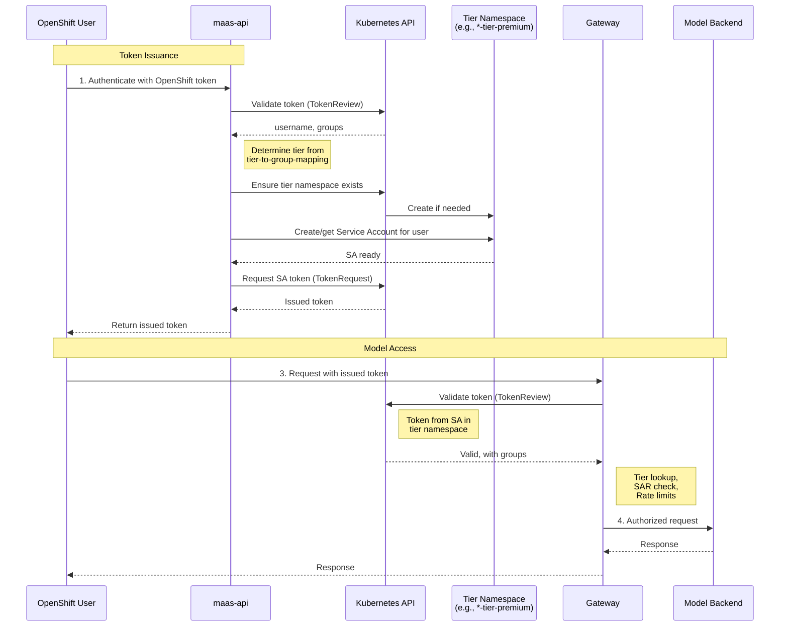

# Token Management and Service Account Integration

This guide explains how to obtain and use tokens to access models in the tier-based access control system. 
It covers the token issuance mechanism, service account integration, and token lifecycle management.

!!! note
    **Prerequisites**: This document assumes you have already configured tiers, RBAC, and rate limits. 
    See [Configuring Subscription Tiers](tiers.md) for setup instructions.

---

## Table of Contents

1. [Overview](#overview)
1. [How Token Issuance Works](#how-token-issuance-works)
1. [Getting and Using Your Token: A Practical Guide](#getting-and-using-your-token-a-practical-guide)
1. [Token Lifecycle Management](#token-lifecycle-management)
1. [Frequently Asked Questions (FAQ)](#frequently-asked-questions-faq)
1. [Related Documentation](#related-documentation)

---

## Overview

The platform uses a secure, token-based authentication system. Instead of using your primary OpenShift credentials to 
access models directly, you first exchange them for a temporary, specialized access token. This approach provides several key benefits:

- **Enhanced Security**: Tokens are short-lived, reducing the risk of compromised credentials. They are also narrowly scoped for model access only.
- **Tier-Based Access Control**: The token you receive is automatically associated with your subscription tier (e.g., free, premium), ensuring you get the correct permissions and rate limits.
- **Auditability**: Every request made with a token is tied to a specific identity and can be audited.
- **Kubernetes-Native Integration**: The system leverages standard, robust Kubernetes authentication and authorization mechanisms.

The process is simple:

```text
You authenticate with OpenShift → Request a token from the API → Use that token to call models
```

---

## How Token Issuance Works

When you request a token, you are essentially trading your long-term OpenShift identity for a short-term, 
purpose-built identity in the form of a Kubernetes Service Account.

### Key Concepts

- **Tier Namespace**: The platform maintains a separate Kubernetes namespace for each subscription tier (e.g., `...-tier-free`, `...-tier-premium`). These namespaces isolate users based on their access level. 
- **Service Account (SA)**: When you request a token for the first time, the system creates a Service Account that represents you inside your designated tier namespace. This SA inherits all the permissions assigned to that tier.
- **Access Token**: The token you receive is a standard JSON Web Token (JWT) that authenticates you as that specific Service Account. When you present this token to the gateway, the system knows your identity, your tier, and what permissions you have.
- **Token Audience**: The intended recipient of your token. This is validated during authentication and must match the gateway's configuration.
- **Token Expiration**: The time after which the token expires. Tokens are short-lived to reduce the risk of compromised credentials.

### Token Issuance Flow

This diagram illustrates the process of obtaining a token.



---

## Getting and Using Your Token: A Practical Guide

Follow these steps to get a token and use it to make an inference request.

### Step 1: Get Your OpenShift Authentication Token

First, you need your OpenShift token to prove your identity to the maas-api

Log in to your OpenShift cluster if you haven't already
```shell
oc login ...
```

Get your current OpenShift authentication token
```shell
OC_TOKEN=$(oc whoami -t)
```

### Step 2: Request an Access Token from the API

Next, use that OpenShift token to call the maas-api `/v1/tokens` endpoint. 
You can specify the desired expiration time; the default is 4 hours.


```shell
HOST="https://maas.yourdomain.io"
MAAS_API_URL="${HOST}/maas-api"

TOKEN_RESPONSE=$(curl -sSk \
  -H "Authorization: Bearer ${OC_TOKEN}" \
  -H "Content-Type: application/json" \
  -d '{"expiration": "15m"}' \
  "${MAAS_API_URL}/v1/tokens")

ACCESS_TOKEN=$(echo $TOKEN_RESPONSE | jq -r .token)

echo $ACCESS_TOKEN
```

!!! note
    Replace with the actual route to your `maas-api` instance.

### Step 3: Use the Access Token to Call the Model

Use the newly obtained `ACCESS_TOKEN` in the Authorization header to make requests to the model serving endpoint.

You can get model's address by calling `/v1/models` endpoint.

```shell
MODELS=$(curl ${HOST}/maas-api/v1/models  \
    -H "Content-Type: application/json" \
    -H "Authorization: Bearer ${ACCESS_TOKEN}")

echo $MODELS | jq .
MODEL_URL=$(echo $MODELS | jq -r '.data[0].url')
MODEL_NAME=$(echo $MODELS | jq -r '.data[0].id')

curl -sSk \
  -H "Authorization: Bearer ${ACCESS_TOKEN}" \
  -H "Content-Type: application/json" \
  -d "{
        \"model\": \"${MODEL_NAME}\",
        \"prompt\": \"Not really understood prompt\",
        \"max_prompts\": 40
    }" \
  "${MODEL_URL}/v1/chat/completions";
```

---

## Token Lifecycle Management

Access tokens are ephemeral and must be managed accordingly.

### Token Expiration

Tokens have a finite lifetime for security purposes:

- **Default lifetime**: 4 hours (configurable when requesting)
- **Maximum lifetime**: Determined by your Kubernetes cluster configuration

When a token expires, any API request using it will fail with an `HTTP 401 Unauthorized error`. 
To continue, you must request a new token using the process described above.

**Tips:**
- For interactive use, request tokens with a lifetime that covers your session (e.g., 4h).
- For automated scripts or applications, implement logic to refresh the token proactively before it expires.

### Token Revocation

You can invalidate all active tokens associated with your user account. This is a key security feature if you believe a token has been exposed.

To revoke all your tokens, send a `DELETE` request to the `/v1/tokens` endpoint.

```shell
curl -sSk -X DELETE "${MAAS_API_URL}/v1/tokens" \
  -H "Authorization: Bearer $(oc whoami -t)"
```
This action immediately deletes your underlying Service Account, which invalidates all tokens that have ever been issued for it. 
The Service Account will be automatically recreated the next time you request a token.

!!! important "For Platform Administrators"
    Admins can manually revoke a user's tokens by finding and deleting their Service Account 
    in the appropriate tier namespace (e.g., `<instance-name>-tier-premium`). This is an effective way to immediately cut 
    off access for a specific user in response to a security event.

---

## Frequently Asked Questions (FAQ)

**Q: My tier is wrong or shows as "free". How do I fix it?**

A: Your tier is determined by your group membership in OpenShift. Contact your platform administrator to ensure you 
are in the correct user group, which should be mapped to your desired tier in the [tier mapping configuration](tiers.md).

---

**Q: How long should my tokens be valid for?**

A: It's a balance of security and convenience. For interactive command-line use, 1-8 hours is common. For applications, request shorter-lived tokens (e.g., 15-60 minutes) and refresh them automatically.

---

**Q: Can I have multiple active tokens at once?**

A: Yes. Each call to the `/v1/tokens` endpoint issues a new, independent token. All of them will be valid until they expire or are revoked.

---

**Q: What happens if the `maas-api` service is down?**

A: You will not be able to issue *new* tokens. However, any existing, non-expired tokens will continue to work for calling models, as the gateway validates them directly with the Kubernetes API.

---

**Q: Can I use one token to access multiple different models?**

A: Yes. Your token grants you access based on your tier's RBAC permissions. If your tier is authorized to use multiple models, a single token will work for all of them.

---

## Related Documentation

- **[Configuring Subscription Tiers](tiers.md)**: For operators - tier setup, RBAC, and rate limiting configuration
- **maas-api Architecture**: See `maas-api/architecture.md` for system design details
- **API Specification**: See `maas-api/openapi3.yaml` for complete API reference

---

