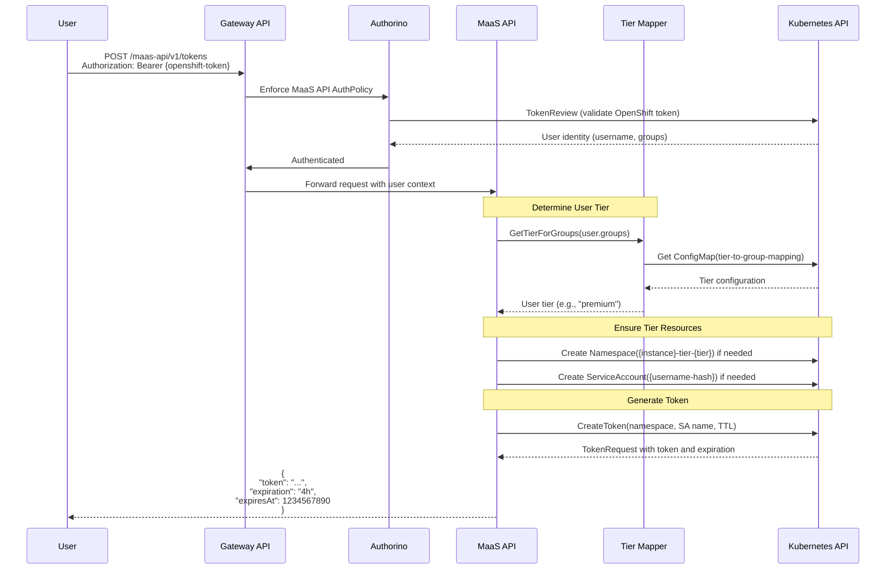
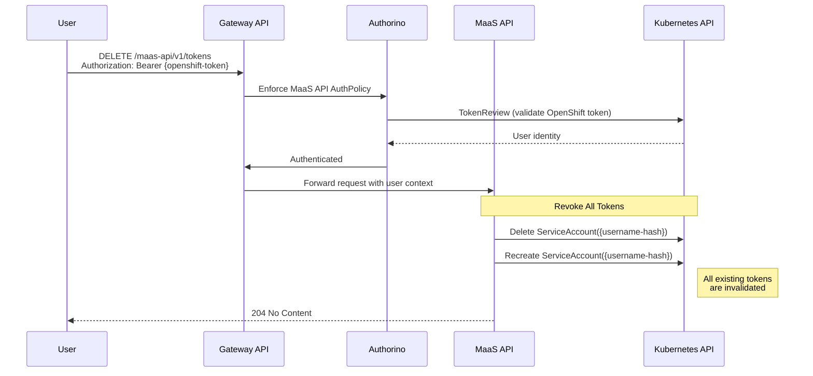
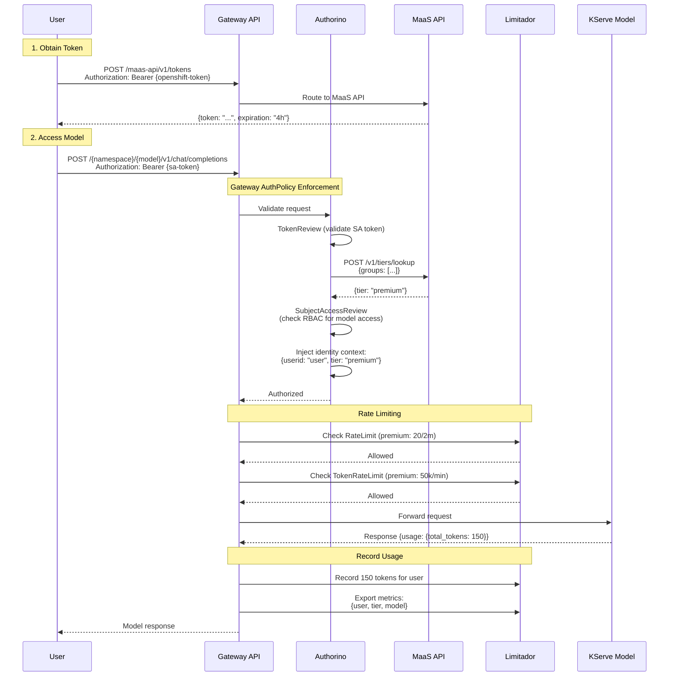

# MaaS API Architecture

## Overview

The MaaS (Models as a Service) API provides a tier-based token management system for accessing AI models through KServe. It integrates with OpenShift authentication, Kuadrant policies, and Gateway API to deliver multi-tenant access control, rate limiting, and usage metrics for LLM inference services.

## Key Features

- **Tier-Based Access Control**: Users are assigned to tiers (free, premium, enterprise) based on Kubernetes group membership
- **Short-Lived Token Issuance**: Self-service ephemeral tokens with configurable expiration
- **Rate & Token Limiting**: Per-tier request and token consumption limits
- **Model Discovery**: Automatic listing of available KServe LLMInferenceServices
- **Usage Metrics**: Real-time telemetry with user, tier, and model tracking
- **Kubernetes-Native**: Leverages Service Accounts, RBAC, and TokenReview for authentication

## Technology Stack

- **Backend**: Go with Gin framework
- **Authentication**: Kubernetes TokenReview API + OpenShift OAuth
- **Authorization**: Kubernetes SubjectAccessReview (RBAC)
- **Gateway**: OpenShift Gateway API implementation
- **Policies**: Kuadrant (AuthPolicy, RateLimitPolicy, TokenRateLimitPolicy, TelemetryPolicy)
- **Model Serving**: KServe LLMInferenceServices
- **Metrics**: Prometheus via Limitador and TelemetryPolicy
- **Rate Limiting**: Limitador (part of Kuadrant)

## API Endpoint Reference

| Endpoint             | Method | Purpose                                | Request Body      | Response                    |
|----------------------|--------|----------------------------------------|-------------------|-----------------------------|
| `/health`            | GET    | Service health check                   | None              | Health status               |
| `/v1/models`         | GET    | List available LLMInferenceServices    | None              | OpenAI-compatible list      |
| `/v1/tokens`         | POST   | Issue ephemeral short-lived token      | `{"expiration"}` | Token with expiration       |
| `/v1/tokens`         | DELETE | Revoke all ephemeral tokens for user   | None              | Success confirmation        |
| `/v1/api-keys`       | POST   | Create named API key (long-lived)      | `{"expiration", "name"}` | Token with metadata |
| `/v1/api-keys`       | GET    | List all API keys for user             | None              | Array of API key metadata   |
| `/v1/api-keys/{id}`  | GET    | Get specific API key by ID             | Bearer token      | API key metadata            |
| `/v1/tiers/lookup`   | POST   | Lookup tier for user groups (internal) | `{"groups"}`     | `{"tier", "displayName"}`                 |

## Core Architecture Components

### 1. MaaS API Service

- **Language**: Go with Gin framework
- **Port**: 8080
- **Service Account**: `maas-api` with cluster-wide permissions
- **Purpose**: Central API for token management and model discovery
- **Features**:
  - Ephemeral token generation via Kubernetes Service Account TokenRequest API
  - Tier-based namespace and Service Account management
  - KServe model discovery across all namespaces
  - Health checks and CORS support (debug mode)

**Key Components**:
- **Token Manager**: Creates/revokes Service Account tokens
- **Token Reviewer**: Validates tokens via Kubernetes TokenReview API
- **Tier Mapper**: Maps user groups to tiers using ConfigMap
- **Model Manager**: Discovers LLMInferenceServices

### 2. Kuadrant Policy Engine

**Deployed Components**:
- **Authorino**: Authentication and authorization policy enforcement
- **Limitador**: Rate limiting and token counting engine
- **Kuadrant Operator**: Policy CRD management and synchronization

**Policies Applied**:

#### Gateway AuthPolicy

- **Target**: `maas-default-gateway` (Gateway)
- **Authentication**: Service Account tokens via `kubernetesTokenReview`
- **Metadata Enrichment**: Calls MaaS API `/v1/tiers/lookup` to determine user tier (cached for 300s)
- **Authorization**: Kubernetes SubjectAccessReview for model access (checks user can POST to specific LLMInferenceService)
- **Identity Injection**: Adds `userid` and `tier` to request context for downstream policies

#### MaaS API AuthPolicy

- **Target**: `maas-api-route` (HTTPRoute)
- **Authentication**: OpenShift user tokens via `kubernetesTokenReview`
- **Purpose**: Allows authenticated OpenShift users to issue tokens

#### RateLimitPolicy

- **Target**: `maas-default-gateway` (Gateway)
- **Limits by Tier**:
  - Free: 5 requests per 2 minutes
  - Premium: 20 requests per 2 minutes
  - Enterprise: 50 requests per 2 minutes
- **Counter**: Per user (`auth.identity.userid`)

#### TokenRateLimitPolicy

- **Target**: `maas-default-gateway` (Gateway)
- **Limits by Tier** (tokens per minute):
  - Free: 100 tokens/min
  - Premium: 50,000 tokens/min
  - Enterprise: 100,000 tokens/min
- **Counter**: Per user (`auth.identity.userid`)
- **Token Extraction**: Automatically reads `usage.total_tokens` from response body

#### TelemetryPolicy

- **Target**: `maas-default-gateway` (Gateway)
- **Metrics Labels**:
  - `model`: Extracted from response body (`/model`)
  - `tier`: From identity context
  - `user`: From identity context
- **Purpose**: Export usage metrics to Prometheus via Limitador

### 3. Gateway API and Routing

Two gateways are deployed:

1. **openshift-ai-inference**:
   - Basic HTTP gateway for non-MaaS model access
   - No authentication or rate limiting
   - Allows direct access to models

2. **maas-default-gateway**:
   - Managed MaaS gateway with full policy enforcement
   - Hostname: `maas.${CLUSTER_DOMAIN}`
   - Listeners: HTTP (80) and HTTPS (443)
   - Policies: Auth, RateLimit, TokenRateLimit, Telemetry

**HTTPRoute for MaaS API**:
- `/v1/models` → `maas-api:8080` (OpenAI-compatible endpoint at root)
- `/maas-api/*` → `maas-api:8080` (with prefix rewrite to `/`)

### 4. Tier Management

The tier configuration defines three tiers with increasing levels of access:

- **free** (level 0): Default for all authenticated users via `system:authenticated` group
- **premium** (level 1): For users in premium groups
- **enterprise** (level 2): Highest tier for enterprise/admin groups

**Tier Resolution Logic**:
1. User groups are extracted from OpenShift token
2. Tiers are sorted by level (highest first)
3. First matching tier based on group membership wins
4. Service Account group (`system:serviceaccounts:<tier-namespace>`) is automatically added to tier groups

**Tier Namespace Convention**:
- Format: `{instance-name}-tier-{tier-name}`
- Example: `maas-default-gateway-tier-free`
- Namespaces are created automatically when first token is issued

### 5. KServe Model Services

**Supported CRDs**:
- **LLMInferenceService** (`serving.kserve.io/v1alpha1`)

**Model Discovery**:
- Queries all namespaces for LLMInferenceServices
- Extracts model ID from `spec.model.name` or falls back to `metadata.name`
- Checks readiness via status conditions
- Returns OpenAI-compatible model list with URL and ready status

**Model URL Resolution**:
1. Primary: `status.url`
2. Fallback: First URL in `status.addresses[]`

### 6. Token Lifecycle

**Service Account-Based Token Architecture**:

The system uses Kubernetes Service Account tokens as the primary authentication mechanism. Each user gets a dedicated Service Account in their tier namespace.

## Token Issuance Workflow



### Token Issuance Details

**Step 1: Authentication**
- User authenticates with OpenShift token (`oc whoami -t`)
- MaaS API AuthPolicy validates token via Kubernetes TokenReview
- User context (username, groups, UID) is extracted

**Step 2: Tier Determination**
- User groups are matched against tier configuration
- Highest level tier wins (enterprise > premium > free)
- Projected Service Account group is added: `system:serviceaccounts:{tier-namespace}`

**Step 3: Resource Provisioning**
- Tier namespace is created if missing: `{instance}-tier-{tier}`
- Service Account is created if missing: `{username-sanitized}-{hash}`
  - Username sanitization: lowercase, replace invalid chars with `-`, max 63 chars
  - Hash suffix prevents collisions (first 8 chars of SHA1)
- Labels applied for tracking tier and instance association

**Step 4: Token Generation**
- Uses Kubernetes TokenRequest API (`ServiceAccounts().CreateToken()`)
- Audience: `{instance}-sa`
- TTL: User-specified (default: 4 hours)
- Returns token, expiration duration, and Unix timestamp

### Token Revocation Workflow



**Revocation Mechanism**:
- Kubernetes doesn't support individual token revocation
- Solution: Delete and recreate the Service Account
- All tokens issued from that Service Account become invalid immediately
- New Service Account can immediately issue new tokens

## Model Access Workflow



### Model Access Details

**Step 1: Token-Based Authentication**
- Gateway extracts Bearer token from Authorization header
- Authorino performs TokenReview to validate Service Account token
- Token audience is checked: `maas-default-gateway-sa`
- User ID is normalized from full SA name: `system:serviceaccount:{ns}:{name}` → `{name}`

**Step 2: Tier Lookup with Caching**
- Authorino calls MaaS API: `POST /v1/tiers/lookup` with user groups
- User groups include the tier-specific SA group: `system:serviceaccounts:{tier-namespace}`
- Response is cached for 300 seconds (5 minutes) per username
- Tier is added to identity metadata: `auth.identity.tier`

**Step 3: Authorization via RBAC**
- Authorino performs Kubernetes SubjectAccessReview
- Checks if user can POST to specific LLMInferenceService
- Resource attributes:
  - Group: `serving.kserve.io`
  - Resource: `llminferenceservices`
  - Namespace: Extracted from request path (`/{namespace}/{model}/...`)
  - Name: Extracted from request path
  - Verb: `post`

**Step 4: Rate Limiting**
- Limitador checks request count against tier limit
- Counter key: `auth.identity.userid`
- Returns 429 if limit exceeded

**Step 5: Token Rate Limiting**
- Pre-checks estimated token usage (if available)
- Actual token usage is recorded from response body: `usage.total_tokens`
- Counter key: `auth.identity.userid`
- Returns 429 if token limit exceeded

**Step 6: Telemetry Export**
- Limitador exports metrics with labels:
  - `model`: Extracted from response body JSON (`/model`)
  - `tier`: From auth identity context
  - `user`: From auth identity context
- Metrics available in Prometheus format at Limitador metrics endpoint

## Detailed Component Workflows

### Tier Lookup Endpoint

**Purpose**: Internal API for Gateway AuthPolicy to determine user tier

**Endpoint**: `POST /v1/tiers/lookup`

**Request**:
```json
{
  "groups": [
    "system:serviceaccounts:maas-default-gateway-tier-premium",
    "system:authenticated",
    "premium-group"
  ]
}
```

**Response**:
```json
{
  "tier": "premium",
  "displayName": "Premium Tier"
}
```

**Implementation**:
1. Receive user groups in request body
2. Load tier configuration from ConfigMap `tier-to-group-mapping`
3. Sort tiers by level (highest first)
4. Find first tier containing any of the user groups
5. Return tier info (name and displayName) or 404 if no match

**Error Handling**:
- 400: Invalid request body
- 404: No tier found for any group
- 500: Failed to load tier configuration

### Model Discovery

**Endpoint**: `GET /v1/models` - List LLMInferenceServices

**Response Format** (OpenAI-compatible):
```json
{
  "object": "list",
  "data": [
    {
      "id": "facebook-opt-125m",
      "object": "model",
      "created": 1703001234,
      "owned_by": "models-namespace",
      "url": "http://facebook-opt-125m.models.svc.cluster.local",
      "ready": true
    }
  ]
}
```

**Discovery Process**:
1. Query Kubernetes for all LLMInferenceServices across all namespaces
2. For each resource:
   - Extract model ID from `spec.model.name` or `metadata.name`
   - Determine URL from `status.url` or `status.addresses[0].url`
   - Check readiness:
     - Not marked for deletion
     - `status.observedGeneration` matches `metadata.generation`
     - All conditions have `status: "True"`
3. Convert to OpenAI model format
4. Return array of models

### Service Account Name Sanitization

**Problem**: Kubernetes usernames can contain characters invalid for Service Account names

**Examples**:
- Email: `user@example.com` (contains `@`, `.`)
- LDAP DN: `CN=User,OU=Users,DC=example,DC=com` (contains `=`, `,`)

**Sanitization Algorithm**:
1. Convert to lowercase
2. Replace all invalid characters (`[^a-z0-9-]`) with `-`
3. Collapse consecutive dashes to single dash
4. Trim leading/trailing dashes
5. Append 8-character SHA1 hash of original username (collision prevention)
6. Truncate to 63 characters total (Kubernetes limit)

**Examples**:
- `user@example.com` → `user-example-com-a1b2c3d4`
- `CN=User,OU=Users` → `cn-user-ou-users-e5f6g7h8`

## Security Considerations

### Authentication Security

1. **Two-Stage Authentication**:
   - Stage 1: OpenShift token validates user identity (for token issuance)
   - Stage 2: Service Account token authenticates model access

2. **Token Scoping**:
   - Service Account tokens are scoped to specific audience: `{instance}-sa`
   - Tokens cannot be used outside the MaaS gateway context

3. **Short-Lived Tokens**:
   - Default: 4 hours
   - Configurable per request
   - Automatic expiration enforced by Kubernetes

4. **Revocation**:
   - All user tokens can be revoked via Service Account recreation
   - No persistent token storage (stateless)

### Authorization Security

1. **Kubernetes RBAC Integration**:
   - Model access requires Kubernetes RBAC permissions
   - Fine-grained control per namespace and model name

2. **Tier-Based Isolation**:
   - Each tier has dedicated namespace
   - Service Accounts cannot cross tier boundaries
   - Network policies can further isolate tiers

3. **Identity Propagation**:
   - User identity is preserved through all policy layers
   - Authorino injects normalized user ID into request context

### Rate Limiting Security

1. **Multi-Level Protection**:
   - Request-based limits prevent API abuse
   - Token-based limits prevent cost-based attacks

2. **Per-User Accounting**:
   - Limits enforced per user ID (from Service Account name)
   - Prevents shared token abuse

3. **Tier Enforcement**:
   - Limits cannot be bypassed by switching tokens
   - Tier is re-evaluated on each request via cached lookup

## Metrics and Observability

### Available Metrics

**Source**: Limitador (exposed on port 8080 at `/metrics`)

**Metric Types**:
1. **Request Counters**:
   - `limitador_rate_limit_counter` - Requests per user/tier
   - Labels: `user`, `tier`, `namespace`

2. **Token Counters**:
   - `limitador_token_rate_limit_counter` - Tokens consumed per user/tier
   - Labels: `user`, `tier`, `namespace`

3. **Telemetry Metrics** (via TelemetryPolicy):
   - Custom metrics with model, user, and tier labels
   - Exports: `model`, `tier`, `user`

### Monitoring Setup

**Prometheus ServiceMonitor**:
- Scrapes Limitador metrics endpoint
- Interval: 30 seconds
- Labels for Grafana dashboards

**Access Metrics**:
```bash
# Port-forward Limitador
kubectl port-forward -n kuadrant-system svc/limitador-limitador 8080:8080

# Query metrics
curl http://localhost:8080/metrics | grep -E '(rate_limit|token_rate_limit)'
```

## Deployment Architecture

### Namespace Organization

```
openshift-ingress/
├── Gateway: maas-default-gateway
├── Gateway: openshift-ai-inference
├── AuthPolicy: gateway-auth-policy
├── RateLimitPolicy: gateway-rate-limits
├── TokenRateLimitPolicy: gateway-token-rate-limits
└── TelemetryPolicy: user-group

maas-api/
├── Deployment: maas-api
├── Service: maas-api
├── ServiceAccount: maas-api (with cluster permissions)
├── HTTPRoute: maas-api-route
├── AuthPolicy: maas-api-auth-policy
└── ConfigMap: tier-to-group-mapping

kuadrant-system/
├── Deployment: authorino
├── Deployment: limitador
└── Deployment: kuadrant-operator

{instance}-tier-free/       (created dynamically)
├── ServiceAccount: user1-a1b2c3d4
├── ServiceAccount: user2-e5f6g7h8
└── ...

{instance}-tier-premium/    (created dynamically)
└── ServiceAccount: user3-i9j0k1l2

{instance}-tier-enterprise/ (created dynamically)
└── ServiceAccount: admin1-m3n4o5p6
```

### RBAC Requirements

**MaaS API Service Account Permissions**:

The MaaS API requires cluster-level permissions for:
- **Token management**: Create, list, get, and delete Service Accounts and Service Account tokens
- **Namespace management**: Create, list, get namespaces for tier isolation
- **Authentication**: Create TokenReviews to validate user tokens
- **Model discovery**: List and get LLMInferenceServices across all namespaces
- **Tier configuration**: Read ConfigMaps for tier-to-group mapping

**User Model Access RBAC**:

Users access models through their tier-specific Service Account. Access is granted via RoleBindings that bind tier groups to roles with POST permissions on LLMInferenceService resources.

Example tier-based access pattern:
- Subject: Group `system:serviceaccounts:maas-default-gateway-tier-premium`
- Namespace: `models-namespace`
- Resource: `llminferenceservices.serving.kserve.io`
- Verb: `post`

## Configuration Reference

### Environment Variables

**MaaS API Deployment**:
- `NAMESPACE`: Namespace where MaaS API is deployed (from fieldRef)
- `PORT`: HTTP server port (default: `8080`)
- `DEBUG_MODE`: Enable CORS and debug logging (default: `false`)

### Tier Configuration

**ConfigMap**: `tier-to-group-mapping` (namespace: `maas-api`)

The tier configuration uses a list structure with the following fields per tier:

**Tier Fields**:
- `name`: Tier identifier (used in namespace naming and policy matching)
- `displayName`: Optional UI-friendly label (falls back to `name` if not set)
- `level`: Priority integer (higher wins in case of multiple group matches)
- `groups`: Array of Kubernetes groups that belong to this tier

**Special Groups**:
- `system:authenticated`: Default group for all authenticated users (typically assigned to free tier)
- `system:serviceaccounts:{tier-namespace}`: Automatically added for each tier to enable tier-based routing

